**This document is a reference guide for my own personal use. Outline, concepts, and text has been taken (at times verbatim) from Brendan Gregg's "Systems Performance: Enterprise and the Cloud". Moving forward I plan on incorporating text from Michael Kerrisk's "The Linux Programming Interface: A Linux and Unix Systems Programming Handbook" in order to supplement detail at a lower programmatic level. I TAKE ABSOLUTELY NO CREDIT FOR ANY WORK IN THIS DOCUMENT AND THIS IS ONLY A SUMMARIZATION. If you are interested in these topics I HIGHLY recommend buying two books mentioned above.**

<!-- TOC depthFrom:1 depthTo:6 withLinks:1 updateOnSave:1 orderedList:0 -->

- [Application Level](#application-level)
	- [Initialization tax & I/O Size](#initialization-tax-io-size)
	- [Buffering](#buffering)
	- [Concurrency and Parallelism](#concurrency-and-parallelism)
		- [Non-Blocking I/O](#non-blocking-io)
	- [Process Binding](#process-binding)
	- [Thread State Analysis](#thread-state-analysis)
	- [Syscall Analysis](#syscall-analysis)
	- [I/O Profiling](#io-profiling)
- [CPU Level](#cpu-level)
	- [Terminology:](#terminology)
	- [CPU Architecture:](#cpu-architecture)
	- [Utilization](#utilization)
	- [User-Time/Kernel-Time](#user-timekernel-time)
	- [Saturation](#saturation)
	- [Scheduling classes (threads)](#scheduling-classes-threads)
	- [NUMA Grouping](#numa-grouping)
	- [Tools Methodology](#tools-methodology)
	- [Tools Rundown for CPU](#tools-rundown-for-cpu)
	- [Tuning](#tuning)
		- [Scheduling Priority and Class](#scheduling-priority-and-class)
		- [Process Binding](#process-binding)
		- [Exclusive CPU sets](#exclusive-cpu-sets)
		- [Resource Controls](#resource-controls)
- [Memory Level](#memory-level)
	- [Performance factor overview -](#performance-factor-overview-)
	- [Terminology](#terminology)
	- [File system paging](#file-system-paging)
	- [Anonymous Paging](#anonymous-paging)
	- [Demand Paging and Faults](#demand-paging-and-faults)
	- [Overcommit](#overcommit)
	- [Swapping](#swapping)
	- [File system Cache Usage](#file-system-cache-usage)
	- [Allocators](#allocators)
	- [Freeing Memory](#freeing-memory)
		- [Free List](#free-list)
	- [Process Address Space](#process-address-space)
		- [Segments:](#segments)
	- [Tools Methodology:](#tools-methodology)
	- [Tools Rundown for Memory](#tools-rundown-for-memory)
	- [Tuning](#tuning)
		- [Kernel Params](#kernel-params)
		- [Multiple Page Sizes](#multiple-page-sizes)
		- [Resource Controls](#resource-controls)
- [File System Level](#file-system-level)
	- [Terminology](#terminology)
	- [file system interfaces](#file-system-interfaces)
	- [file system cache](#file-system-cache)
	- [concepts](#concepts)
		- [file system latency](#file-system-latency)
		- [caching](#caching)
		- [random vs sequential i/o](#random-vs-sequential-io)
		- [prefetch (aka read-ahead)](#prefetch-aka-read-ahead)
	- [write-back caching](#write-back-caching)
		- [synchronous writes](#synchronous-writes)
		- [raw and direct i/o](#raw-and-direct-io)
		- [raw i/o](#raw-io)
		- [direct i/o](#direct-io)
		- [non-blocking i/o](#non-blocking-io)
	- [memory-mapped files](#memory-mapped-files)
		- [metadata](#metadata)
		- [logical metadata](#logical-metadata)
		- [physical metadata](#physical-metadata)
		- [logical versus physical i/o](#logical-versus-physical-io)
		- [unrelated](#unrelated)
		- [indirect:](#indirect)
		- [deflated](#deflated)
		- [inflated](#inflated)
		- [example of 1-byte application write](#example-of-1-byte-application-write)
	- [file system operation performance](#file-system-operation-performance)
	- [capacity](#capacity)
	- [architecture:](#architecture)
	- [vfs:](#vfs)
	- [file system caches](#file-system-caches)
		- [page cache](#page-cache)
		- [dentry cache](#dentry-cache)
		- [inode cache](#inode-cache)
	- [file system features](#file-system-features)
		- [block versus extent](#block-versus-extent)
			- [block-based file systems](#block-based-file-systems)
			- [extent-based filesystems](#extent-based-filesystems)
		- [journaling:](#journaling)
		- [copy-on-write:](#copy-on-write)
		- [scrubbing](#scrubbing)
		- [todo: filesystem types](#todo-filesystem-types)
	- [volumes and pools](#volumes-and-pools)
		- [volumes](#volumes)
		- [pooled storage](#pooled-storage)
		- [additional performance considerations:](#additional-performance-considerations)
	- [methodology](#methodology)
		- [latency analysis](#latency-analysis)
			- [operation latency](#operation-latency)
			- [transaction cost](#transaction-cost)
			- [workload characterization](#workload-characterization)
			- [advanced workload characterization/checklist](#advanced-workload-characterizationchecklist)
			- [performance characteristics](#performance-characteristics)
			- [performance monitoring](#performance-monitoring)
	- [tools rundown for file systems](#tools-rundown-for-file-systems)
		- [strace](#strace)
		- [dtrace](#dtrace)
		- [free](#free)
		- [top](#top)
		- [vmstat](#vmstat)
		- [sar](#sar)
		- [slabtop](#slabtop)
		- [/proc/meminfo](#procmeminfo)
	- [other tools](#other-tools)
	- [experimentation](#experimentation)
		- [ad hoc](#ad-hoc)
		- [micro-benchmarking tools](#micro-benchmarking-tools)
		- [cache flushing](#cache-flushing)
	- [tuning](#tuning)
		- [ext4](#ext4)
- [disks level](#disks-level)
	- [terminology](#terminology)
	- [Models](#models)
		- [Simple disk](#simple-disk)
		- [Caching disk](#caching-disk)
		- [Controller](#controller)
	- [Concepts](#concepts)
		- [Measuring Time](#measuring-time)
			- [Calculating Time](#calculating-time)
		- [Time Scales](#time-scales)
		- [Caching](#caching)
		- [Random versus Sequential I/O](#random-versus-sequential-io)
		- [Read/Write Ratio](#readwrite-ratio)
		- [I/O Size](#io-size)
		- [IOPs](#iops)
			- [Non-Data-Transfer Disk Commands](#non-data-transfer-disk-commands)
			- [Utilization](#utilization)
				- [Virtual Disk Utilization](#virtual-disk-utilization)
			- [Saturation](#saturation)
			- [I/O wait](#io-wait)
	- [TODO: Architecture (Physical)](#todo-architecture-physical)
	- [Operating System Disk I/O Stack](#operating-system-disk-io-stack)
		- [Block Device Interface](#block-device-interface)
			- [* I/O scheduler policies](#-io-scheduler-policies)
	- [Methodology](#methodology)
		- [Tools](#tools)
		- [USE Methodology](#use-methodology)
			- [Disk devices](#disk-devices)
			- [Disk controllers](#disk-controllers)
		- [Workload characteristics](#workload-characteristics)
		- [Advanced Workload Checklist](#advanced-workload-checklist)
		- [Performance characteristics](#performance-characteristics)
		- [Latency Analysis](#latency-analysis)
		- [Event Tracing](#event-tracing)
		- [Micro Benchmarking](#micro-benchmarking)
		- [Disks](#disks)
			- [Disk controllers](#disk-controllers)
		- [TODO: Scaling](#todo-scaling)
	- [Analysis](#analysis)
		- [iostat](#iostat)
		- [sar](#sar)
		- [pidstat,iotop](#pidstatiotop)
		- [blktrace](#blktrace)
- [btrace /dev/sdb](#btrace-devsdb)
		- [MegaCLI](#megacli)
		- [smartctl](#smartctl)
	- [Experimentation](#experimentation)
		- [Ad Hoc](#ad-hoc)
- [dd if=/dev/sda1 of=/dev/null bs=1024k count=1k](#dd-ifdevsda1-ofdevnull-bs1024k-count1k)
		- [Custom Load Generators](#custom-load-generators)
		- [hdparm](#hdparm)
	- [Tuning](#tuning)
		- [Operating system](#operating-system)
			- [ionice](#ionice)
			- [Cgroups](#cgroups)
			- [Tunable Parameters](#tunable-parameters)
- [Network Level](#network-level)
	- [Terminology](#terminology)
	- [Models](#models)
		- [Network Interface](#network-interface)
		- [Controller](#controller)
		- [Protocol Stack](#protocol-stack)
	- [Concepts](#concepts)
		- [Latency](#latency)
			- [Name resolution latency](#name-resolution-latency)
			- [Ping Latency](#ping-latency)
			- [Connection Latency](#connection-latency)
			- [First-Byte Latency](#first-byte-latency)
			- [Connection life span](#connection-life-span)
		- [Buffering](#buffering)
		- [Connection backlog](#connection-backlog)
		- [Utilization](#utilization)
		- [Local Connections](#local-connections)
	- [Architecture](#architecture)
		- [protocols](#protocols)
			- [TCP](#tcp)
				- [Sliding window](#sliding-window)
				- [Congestion avoidance](#congestion-avoidance)
				- [Slow-start](#slow-start)
				- [Selective Acknowledgments (SACKs)](#selective-acknowledgments-sacks)
				- [Fast retransmit](#fast-retransmit)
				- [Fast recovery](#fast-recovery)
				- [Three way handshake](#three-way-handshake)
				- [Duplicate ACK detection](#duplicate-ack-detection)
				- [Congestion Control: Reno and Tahoe](#congestion-control-reno-and-tahoe)
				- [Nagle](#nagle)
				- [Delayed ACKs](#delayed-acks)
				- [SACK and FACK](#sack-and-fack)
			- [UDP](#udp)
	- [Software](#software)
		- [Network Stack](#network-stack)
			- [Techniques for high packet throughput](#techniques-for-high-packet-throughput)
			- [TCP](#tcp)
	- [Methodology](#methodology)
		- [Tools Methodology](#tools-methodology)
		- [USE Methodology](#use-methodology)
		- [Workload characterization](#workload-characterization)
		- [Advanced Workload Characterization](#advanced-workload-characterization)
		- [Latency Analysis](#latency-analysis)
		- [TCP analysis](#tcp-analysis)
			- [Ephemeral Port Exhaustion](#ephemeral-port-exhaustion)
	- [Analysis](#analysis)
		- [netstat](#netstat)
		- [sar](#sar)
		- [ifconfig](#ifconfig)
		- [ip](#ip)
		- [nicstat](#nicstat)
		- [ping](#ping)
		- [traceroute](#traceroute)
		- [pathchar](#pathchar)
		- [tcpdump](#tcpdump)
		- [Wireshark](#wireshark)
		- [Dtrace, perf](#dtrace-perf)
	- [TODO: Tuning](#todo-tuning)

<!-- /TOC -->

# Application Level

## Initialization tax & I/O Size
Transferring I/O incurs overhead such as: initializing buffers, making a system call, context switching, allocating kernel metadata, checking process privileges & limits, mapping addresses to devices, executing kernel and drive code to delivery I/O and freeing metadata and buffers. This tax occurs for both small and large I/O alike. The more I/O transferred by each I/O, the better. Increasing I/O size can increase performance by minimizing overhead. 1 x 128kb I/O is more efficient than 128 x 1kb I/O. However, there is a down size when the application does not need to read a large I/O size. For example a DB performing 8kb random read may run more slowly with 128kb I/O size, as 120kb will be wasted (introducing I/O latency).

**Summary** :I/O size should match the average request size of the application.

## Buffering
 To improve write performance, data may be coalesced in a buffer before being sent to the next level, increasing the I/O size and efficiency of the operation. This may increase write latency also, as the first write to a buffer waits for additional ones before being sent.

## Concurrency and Parallelism

Concurrency is the ability to load and begin executing multiple runnable programs. They do not necessarily execute on-CPU at the same instant. Each of these programs may be an application process. Different functions within an application can be made concurrent (multiprocessing, multithreading). Event-based concurrency uses an event loop in order to service different functions typically with a single thread (Node.js).

Parallelism takes advantage of a multiprocessor system. Applications engaging in parallelism executes over multiple CPUs. Apart from increased throughput of CPU work, multiple threads allow I/O to be performed concurrently, as other threads can execute while a thread blocked on I/O waits.

**TODO: Synchronization primitives and hash table of locks**

### Non-Blocking I/O
Normal process operation would have a process block and enter a sleep state during I/O. This negatively affects concurrent I/O (application must make many threads\processes to handle I/O concurrently) along with being inefficient  for frequent short lived I/O (overhead costs). Non-Blocking I/O issues I/O without blocking.

## Process Binding
Binding a process or thread to a specific CPU. This can improve memory locality of the application, reducing the cycles for memory I/O and improving overall application performance. The OS usually handles this for us. Be careful of this concept in shared cloud server environments (AWS), you may not be the only one binding to a an underlying physical CPU.

## Thread State Analysis
At a minimum two thread states exist: On-CPU (executing) and Off-CPU (waiting for a turn on-CPU, or for I/O, locks, paging, work, and so on…). If most of the time is spent on-CPU, cpu profiling can be applied. If off-CPU other methodologies must be used. Digging deeper Unix like systems provide six states (these are loosely defined):

1. Executing: on-CPU

2. Runnable: waiting for a turn on-CPU

3. Anonymous paging: runnable, but blocked waiting for anonymous page-ins

4. Sleeping: waiting for I/O, including network, block, and data/text page-in

5. Lock: waiting to acquire a synchronization lock (waiting on someone else)

6. Idle: waiting for work

Performance is increased by reducing the time in the first 5 states. You can investigate these states as follows:

1. Executing: Check whether this is user or kernel mode time and the reason for CPU consumption by using profiling. This should give you a hint of which code paths are taking the most time on CPU and show lock spins.

2. Runnable: Spending time in this state means the application needs more CPU resources. Examine CPU load for the entire system, and any CPU limits present for the application (e.g. resource controls)

3. Anonymous paging: A lack of available main memory for the application can cause anonymous paging and delays. Examine memory usage for the entire system and any memory limits presented for the application.

4. Lock: Identify the lock, the thread holding it, and the reason why the holder held it for so long.

Analyzing these symptoms:

1. Time spent executing: *top *reports this as %CPU

2. Runnable: Can be viewed via the kernel’s *schedstats* feature exposed via /proc/*/schedstat. *Perf sched* (perf is a deep profiling tool) can be used also

3. Anonymous paging: Also known as *swapping* can be found if the kernel feature *delay accounting *is enabled (not typically) Dtrace and SystemTap can be used also (profiling tools)

4. Sleeping: Can be determined indirectly with tools such as *pidstat -d * and seeing if the process is performing I/O. If the application is spending a considerable amount of time sleeping due to I/O the tool *pstack *which takes a snapshot of the process's user space stack.

## Syscall Analysis

Studying process execution based on syscall time. We now want to analyze **Executing:** on-CPU (user mode) and **Syscalls:** time during a system call (kernel mode running or waiting). Tools to use for this include *strace, Dtrace, and SystemTap*

## I/O Profiling
*Dtrace* to profile a process’s I/O system calls. These profiles can give you an idea of which functions an application is running take the most time to complete.

# CPU Level

## Terminology:

<table>
  <tr>
    <td>Processor</td>
    <td>Physical chip that plugs into a socket on teh system or processor board and containers one or more CPUs implemented as cores or hardware threads</td>
  </tr>
  <tr>
    <td>Core</td>
    <td>An independent CPU instance on a multicore processor. The use of cores is a way to scale processors, called chip-level multiprocessing </td>
  </tr>
  <tr>
    <td>Hardware Thread</td>
    <td>A CPU architecture that supports executing multiple threads in parellel on a single core (Hyper-Threading), which each thread is an independent CPU instance. </td>
  </tr>
  <tr>
    <td>CPU instruction</td>
    <td>A single CPU operation, from its instruction set. There are instructions for arithmetic operations, memory I/O, and control logic. </td>
  </tr>
  <tr>
    <td>Logical CPU</td>
    <td>Also called a virtual processor, an operating system CPU instance (a schedulable CPU entity). This may be implemented by the processor as a hardware thread (in which case it may be called a virtual core), a core, or a single-core processor</td>
  </tr>
  <tr>
    <td>Scheduler</td>
    <td>The kernel subsystem that assigns threads to run on CPUs</td>
  </tr>
  <tr>
    <td>Run queue</td>
    <td>A queue of runnable threads that are waiting to be serviced by CPUs. </td>
  </tr>
</table>


## CPU Architecture:

**Physical**

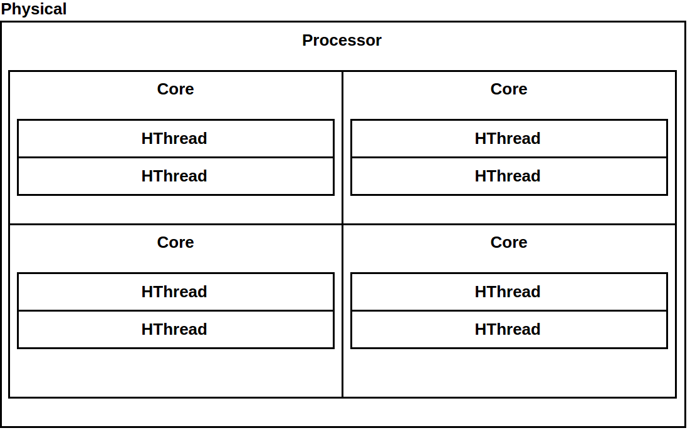

**Seen by OS**

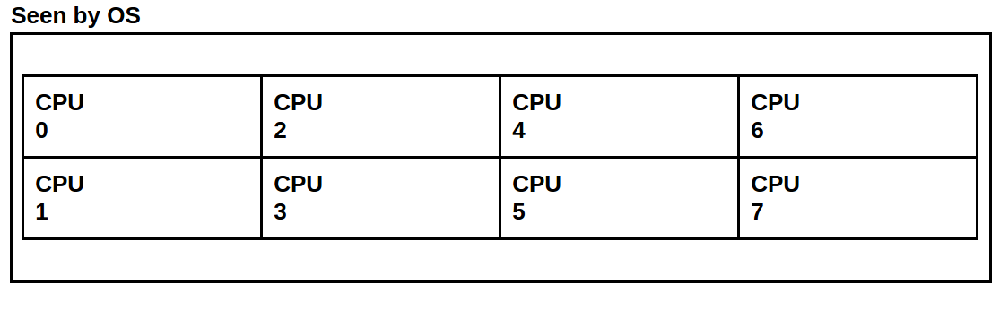

## Utilization
CPU utilization is measured by the time a CPU instance is busy performing work during an interval, expressed as a percentage. CPU performance does not degrade under high usage alone. The measure of utilization spans all clock cycles including memory access (High CPU can actually be indication of frequent memory stalls waiting for memory I/O.)

## User-Time/Kernel-Time
The CPU time spent executing user-level application code is called user-time, and kernel-level code is kernel-time. Kernel-time includes time during system calls, kernel threads, and interrupts. When measured across the system the user/kernel time ratio indicates the type of workload being performed. Applications that are CPU bound may spend almost all their time executing user-level code and have a user/kernel ratio approaching 99/1. Applications that are I/O-intensive have a high rate of system calls, which execute code to perform the I/O.

**Summary**: CPU-Bound workloads = high user time. I/O bound workloads = high kernel time

## Saturation
A CPU at 100% utilization is saturated and threads will encounter scheduler latency (waiting to run on-CPU).

## Scheduling classes (threads)
Scheduling classes manage the behavior of runnable threads, specifically their priorities (**nice values**), whether their on-CPU time is time-sliced, and the duration of those time-slices (time quantum). Additional controls are found via **scheduling policies** which may be selected within a scheduling class and can control scheduling between threads of the same priority. In Linux the nice value sets the **static priority** of the thread, which is separate from the dynamic priority that the scheduler calculates.

Linux provides the following Thread scheduler classes:

* RT: provides fixed and high priorities for real-time workloads. The kernel supports both user- and kernel-level preemption, allowing RT tasks to be dispatched with low latency. The priority range is 0-99.

    * Policies:

        * RR: SCHED_RR is round-robin scheduling. Once a thread has used its time quantum, it is moved to the end of the run queue for that priority level, allow others of the same priority to run.

        * FIFO: SCHED_FIFO is first-in first-out scheduling, which continues running the thread at the head of the run queue until it voluntarily leaves, or until a higher-priority thread arrives. The thread continues to run, even if other threads of the same priority are on the run queue

* O(1): Introduced in Linux 2.6 as the default time-sharing scheduler for user processes. This scheduler dynamically improves the priority of I/O-bound over CPU-bound workloads, to reduce latency of interactive and I/O workloads. Policies: Normal/Batch

* CFS: Completely fair scheduling was added in linux 2.6.23 kernel as the default time-sharing scheduler for user processes. The scheduler manages tasks on a red-black tree instead of traditional run queues, which is keyed from the task CPU time. This allows low CPU consumers to be easily found and executed in preference to CPU-bound workloads, improving the performance of interactive and I/O-bound workloads

    * Policies (Applying to both O(1) and CFS)

        * NORMAL: SCHED_NORMAL is time-sharing scheduling and is the default for user processes. The scheduler dynamically adjusts priority based on the scheduling based on the scheduling class. For O(1), the time slice duration is set based on the static priority: longer durations for higher priority work. For CFS, the time slice is dynamic.

        * BATCH: SCHED_BATCH is similar to SCHED_NORMAL, but with the expectation that the thread will be CPU-bound and should not be scheduled to interrupt other I/O bound interactive work

RT workloads are of highest priority followed by O(1)/CFS and with Idle trailing last.

## NUMA Grouping
Performance on NUMA systems can be significantly improved by making the kernel NUMA-aware, so that it can make better scheduling and memory placement decisions. This can automatically detect and create groups of localized CPU and memory resources and organize them in a topology to reflect the NUMA architecture. This topology allows the cost of any memory access to be estimated. On Linux these groupings are called **scheduling domains** which are in a topology beginning with the* root domain.*

## Tools Methodology
This analysis methodology covers the tools that can be used to analyze CPU performance

1. uptime: check load averages to see if CPU load is increasing or decreasing.

2. vmstat: Run vmstat per second, and check the idle columns to see how much headroom there is. Less than 10% can be a problem

3. mpstat: Check for individual hot (busy) CPUs, identifying a possible thread scalability problem

4. top/prstat: See which processes and users are the top CPU consumers

5. pidstat/prstat: Break down the top CPU consumers into user- and system-time

6. perf/dtrace/stap/oprofile: Profile CPU usage stack traces for either user- or kernel-time, to identify why the CPUs are in use

7. perf/cpustat: Measure CPI

## Tools Rundown for CPU
```
vmstat (ran with no flags):
vmstat's first run will report metrics from system start

Sample output:
procs -----------memory---------- ---swap-- -----io---- -system-- ------cpu-----
 r  b   swpd   free   buff  cache   si   so    bi    bo   in   cs us sy id wa st
 2  0      0 1625548  15580 364464    0    0    14     7    8   10  0  0 100  0  0

r: number of processes waiting for run time
b: number of processes in uninterruptible sleep

us: spent running non-kernel code (user-time, including nice time)
sy: spent running kernel code. (system time)
id: spend idle
wa: time spent waiting for IO
st: time stolen from a virtual machine (virtualization specific)
```

```
mpstat (ran with -P ALL flag, will not repeat metrics explanation when listed above also):
Use mpstat when you want the same information vmstat gives you, but broken down by cpu

Sample output:
11:23:32 AM  CPU    %usr   %nice    %sys %iowait    %irq   %soft  %steal  %guest  %gnice   %idle
11:23:32 AM  all    0.03    0.01    0.04    0.01    0.00    0.00    0.00    0.00    0.00   99.92
11:23:32 AM    0    0.02    0.01    0.03    0.01    0.00    0.00    0.00    0.00    0.00   99.94
11:23:32 AM    1    0.05    0.02    0.04    0.01    0.00    0.00    0.00    0.00    0.00   99.89

cpu: processor number
%nice: percentage of cpu utilization that occurred while executing at the user level with nice priority
%irq: percentage of time spent by the CPU or CPUs to service interrupts
%soft: percentage of time servicing softirqs (software interrupts)
%steal: same as st from above
```

```
pidstat (ran 1 second interval pidstat 1 ):
Use pidstat when you want the same information vmstat gives you, but broken down by PID

11:43:41 AM   UID       PID    %usr %system  %guest    %CPU   CPU  Command
11:43:42 AM     0       147    0.00    0.99    0.00    0.99     1  kworker/1:2

11:43:42 AM   UID       PID    %usr %system  %guest    %CPU   CPU  Command
11:43:43 AM     0         7    0.00    1.00    0.00    1.00     1  rcu_sched
```
**Summary** When looking for **system wide** CPU information use **_vmstat_***. *When looking for **per virtual core** CPU information use **_mpstat_**. When looking for **per process** CPU information use **_pidstat_**.

## Tuning

### Scheduling Priority and Class

*nice* command can be used to adjust process priority. Positive nice values decrease priority, and negative nice values increase priority.

*chrt* command can show and set the scheduling priority directly, and the scheduling policy.

### Process Binding

*taskset* command uses a CPU mask or ranges to set CPU affinity

### Exclusive CPU sets

Linux provides *cpusets*, which allow CPUs to be grouped and processes assigned to them. This can improve performance similarly to process binding. But performance can be improved further by making cpuset exclusive -- preventing other processes from using it.

Reference documentation for full details (it’s a pseudo file system that needs to be mounted similar to Cgroups.)

### Resource Controls

Linux has container groups (Cgroups), which control resource usage by processes or groups of processes. CPU usage can be controlled using shares, and the CFS scheduler allows fixed limits to be imposed (CPU bandwidth), in terms of allocating microseconds of CPU cycles per interval.

# Memory Level

## Performance factor overview -

* Main memory stores application and kernel instructions, their working data, and file system caches. Exhausting this resource leads to the disk subsystem being used in it’s place, which is orders of magnitude slower

* CPU expense of allocating and freeing memory

* Copying memory

* Managing memory address space mapping

* Memory locality in multi socket architectures (NUMA) (memory attached to local sockets have lower access latency than remote sockets)

## Terminology

<table>
  <tr>
    <td>Main memory</td>
    <td>Alos referred to as physical memory, this describes the fast data storage area of a computer, commonly provided as DRAM</td>
  </tr>
  <tr>
    <td>Virtual memory</td>
    <td>An abstraction of main memory that is (almost) infinite and non contended. Virtual memory is not real memory. </td>
  </tr>
  <tr>
    <td>Resident memory</td>
    <td>Memory that currently resides in main memory</td>
  </tr>
  <tr>
    <td>Anonymous memory</td>
    <td>Memory with no file system location or path name. It includes the working data of a process address space, called the heap</td>
  </tr>
  <tr>
    <td>Address space </td>
    <td>A memory context, there are virtual address spaces for each process, and for the kernel</td>
  </tr>
  <tr>
    <td>Segment</td>
    <td>An area of memory flagged for a particular purpose, such as for storing executable or writable pages</td>
  </tr>
  <tr>
    <td>OOM</td>
    <td>Out of memory, when the kernel detects low available memory.</td>
  </tr>
  <tr>
    <td>Page</td>
    <td>A unit of memory, as used by the OS and CPUs. Historically it is either 4 or 8 kb. Modern processes have multiple page size support for larger sizes.</td>
  </tr>
  <tr>
    <td>Page fault</td>
    <td>An invalid memory access. These are normal occurrences when using on-demand virtual memory.</td>
  </tr>
  <tr>
    <td>Paging</td>
    <td>The transfer of pages between main memory and the storage devices</td>
  </tr>
  <tr>
    <td>Swapping</td>
    <td>From Unix, this is the transfer of entire processes between main memory and the swap devices. Linux often uses swapping to refer to paging to the swap device. </td>
  </tr>
  <tr>
    <td>Swap</td>
    <td>An on-disk area for paged anonymous data and swapped processes. It may be an area on a storage device, also called a physical swap device, or a file system file, called a swap file. Some tools use the term swap to refer to virtual memory (which is confusing and incorrect)</td>
  </tr>
</table>


## File system paging
File system paging is caused by the reading and writing of pages in memory-mapped files. This is attributed to *mmap()* system calls. When needed, the kernel can free memory by paging some out. This is where the terminology gets a bit tric
file system page has been modified in main memory ("dirty"), the page-out will require it to be written to disk. If, instead, the file system page has not been modified (“clean”), the page-out merely frees the memory for immediate reuse, since a copy already exists on disk. Because of this, the term page-out means that a page was moved out of memory—this may or may not have included a write to a storage device (you may see this defined differently).

## Anonymous Paging
Involves data that is private to processes: the process heap and stacks. Anonymous term is used because it has no named location in the operating system (no file system path name). Anonymous paging requires moving the data to the physical swap devices or swap files (swapping). This is considered "bad" paging and hurts performance. Anonymous page-in’s block, anonymous page-outs can be performed asynchronously by the kernel.

## Demand Paging and Faults
maps pages of virtual memory to physical memory on demand. This defers the CPU overhead of creating the mappings until they are actually needed and accessed, instead of at the time a range of memory is first allocated. A page fault occurs as a page is accessed when there is initially no page mapping for virtual to physical memory. If the mapping can be satisfied from another page in memory, it is called a **minor fault**. Page faults that require storage device access such as accessing an uncached memory-mapped file, are called **major faults.** Due to demand allocation any page of virtual memory can be in the following states:

1. Unallocated

2. Allocated, but unmapped (unpopulated and not yet faulted)

3. Allocated, and mapped to main memory (RAM)

4. Allocated, and mapped to the physical swap device (disk) (if page is paged out to swap device)

Transition from B to C is a **page fault**. If it requires disk I/O it’s a **major fault**; otherwise it’s a minor page fault. From these states, two memory usage terms can be also defined:

* **Resident set size (RSS)** : the size of allocated main memory pages (c)

* **Virtual memory size** : the size of all allocated areas (B + C + D)

**Summary:** **File system paging** = paging of known memory-mapped files (files which have a known place on the file system and are identifiable to the OS). **Anonymous Paging** = Paging of a process’s private address space, this is a performance issue! Demand paging = the deferring of virtual to physical memory until necessary. Page faults are the method in which demand paging is implemented. **Minor fault** = When the mapping can happen directly to memory. **Major fault** = when the mapping needs to happen to disk (performance issue!). *RSS* = The size of allocated main memory pages. Virtual memory size = ALL allocated area

## Overcommit
Allows more memory to be allocated than the system can possibly store -- more than physical memory and swap devices combined. Relies on demand paging and the tendancy of applications to not use much of the memory they have allocated. This is a tunable feature (see tuning section)

## Swapping

The movement of an entire process between main memory and the physical swap device or swap file. This is the original Unix technique for managing main memory. This swap includes all private data unless it’s data originating from the file system, in which case the file system is referred to when swapping back into memory. A small amount of process metadata always resides in kernel memory. This is a performance intensive operation.

## File system Cache Usage
The OS uses available memory to cache the file system, improving performance. Memory used for the file system cache can be thought of us "unused" from a systems resource perspective.

## Allocators
User-land libraries or kernel-based routines, which provide the software programmer with an easy interface for memory usage (malloc(), free()). These can affect performance significantly. There are a variety of user- and kernel-level allocators for memory allocation.

  Features:

  * Simple API: for example, malloc(), free()

  * Efficient memory usage: When servicing memory allocations of a variety of sizes, memory usage can become fragmented, where there are many regions that waste memory. Allocators can strive to coalesce the unused regions, so that larger allocations can make use of them, improving efficiency.

  * Performance: Memory allocations can be frequent, and on multithreaded environments they can perform poorly due to contention for synchronization primitives. Allocators can be designed to use locks sparingly and also make useof per-thread or per-CPU caches to improve memory locality.

  * Observability: An allocator may provide statistics and debug modes to show how it is being used, and which code paths are responsible for allocations.

  **Slab allocator:** Manages caches of objects of a specific size, allowing them to be recycled quickly without the overhead of page allocation. Used heavily in kernel allocations, which are frequently for fixed-size structs.

  **Slub allocator:** Addresses shortcomings of Slab allocator (time complexity) and is now default allocator in Linux.

  **glibc**

## Freeing Memory

Linux has several methods to add pages back to the free list (freeing memory)

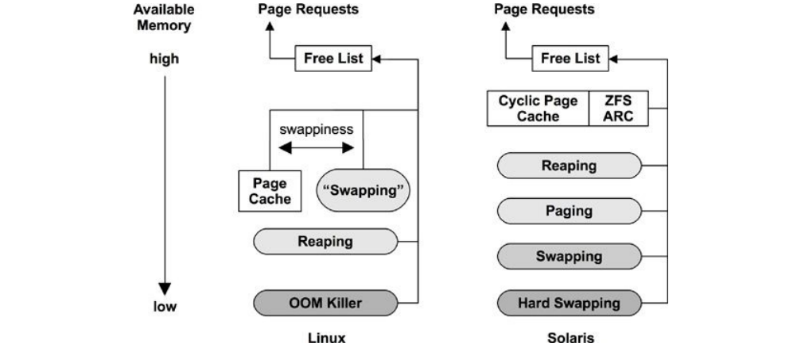

*Linux OS pictures on left, Solaris on right*

### Free List
A list of pages that are unused (also called idle memory) and available for immediate allocation. This is usually implemented as multiple free page lists, one for each locality group (NUMA)

  * Linux uses the buddy allocator for managing pages providing mutiple free lists for different size memory allocations, following a power of two scheme. Buddy refers to finding neighboring pages of free memory so they can be allocated together.

* **Reaping**: when a low memory threshold is crossed, kernel modules and kernel slab allocator can be instructed to immediately free any memory that can easily be freed. Also known as shrinking

    * Mostly involves freeing memory from the kernel slab allocator caches. These caches contain unused memory in slab-size chunks, ready for reuse. Reaping returns this memory to the system for page allocations.

On Linux, specifically the methods are:

* **Page cache**: A cache for file system reads and writes. Parameter **swappiness** sets preference of freeing memory from the page cache verse swapping.

* **Swapping\kswapd**: controlled by the page-out daemon **kswapd**. This daemon finds not-recently-used pages to add to the free list, including application memory. Once located they are paged-out which involves writing these pages to a swap file or swap device.

    * **Page Scanning:** When available memory in the free list drops below a threshold, the page-out daemon begins scanning pages for removal. Page scanning is an indication of memory pressure.

    * Once free memory has reached the lowest threshold, kswapd operates in synchronous mode, freeing pages of memory as they are requested. Tunable lower threshold for this action: vm.min_free_kbytes.

    * The page cache (file system cache) keeps lists for inactive pages and active pages. These operate in LRU fashion, allow kswapd to find free pages quickly:

        * kswapd scans the inactive list first, and then the active if needed. Scanning means walking the lists. If pages are locked or dirty it may be ineligible for being freed.

* **OOM Killer**: finds and kills sacrificial processes, found using select_bad_process() and then killed by calling oom_kill_process().  

## Process Address Space
range of virtual pages that are mapped to physical pages as needed. Split into areas called **segments** for storing thread stacks, process executable, libraries, and heap.

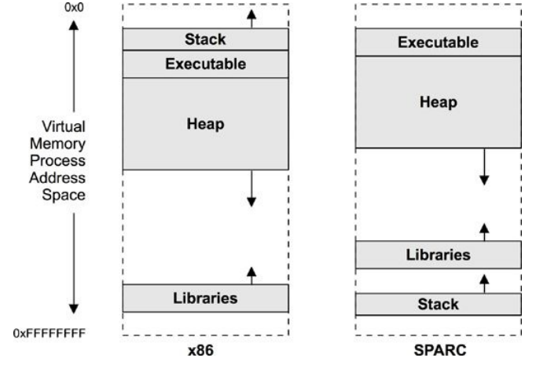

The program executable & Libraries segment contains separate text and data segments (Not pictured above).

### Segments:

* **Executable text**: contains the executable CPU instructions for the process. This is mapped from the text segment of the binary program on the file system. It is read-only with the execute permission

* **Executable data**: contains initialized variables mapped from the data segment of the binary program. This is read/write permissions, so that the variables can be modified while the program is running. It also has a private flag, so that modifications are not flushed to disk.

* **Heap**: This is the working memory for the program and is anonymous memory (no file system location). It grows as needed.

* **Stack**: stacks of the running threads, mapped read/write

## Tools Methodology:

* **Page scanning**: Look for continous page scanning (more than 10s) as a sign of memory pressure. *sar -B* and checking the *pgscan* columns.

* **Paging**: Paging of memory is  further indication that the system is low on memory. *vmstat* and check *si* and *so* columns.

* **vmstat**: Run vmstat per second and check *free* column for available memory

* **OOM Killer**: Check syslog and dmesg for Out of memory messages

* **top**: Which processes and users are the top physical memory consumers (resident) and virtual memory consumers

* **dtrace/stap/perf**: Trace memory allocation with stack traces, to identify the cause of memory usage.

## Tools Rundown for Memory
```
vmstat (ran with 1 second intervals, no flags)

procs -----------memory---------- ---swap-- -----io---- -system-- ------cpu-----
 r  b   swpd   free   buff  cache   si   so    bi    bo   in   cs us sy id wa st
 0  0      0 2666948 628620 22845380    0    0     1    52    1    1  3  1 97  0  0
 0  0      0 2666948 628620 22845380    0    0     0     0  926 1661  4  1 95  0  0
 0  0      0 2666948 628620 22845380    0    0     0     0  872 1619  2  0 97  0  0

swpd: amount of swapped out memory
free: free available memory
buff: memory in the buffer cache
cache: memory in the page cache
si: memory swapped in (paging)
so: memory swapped out (paging)

Shown with -a options:

inact: inactive memory in the page cache
active: memory in the page cache
```

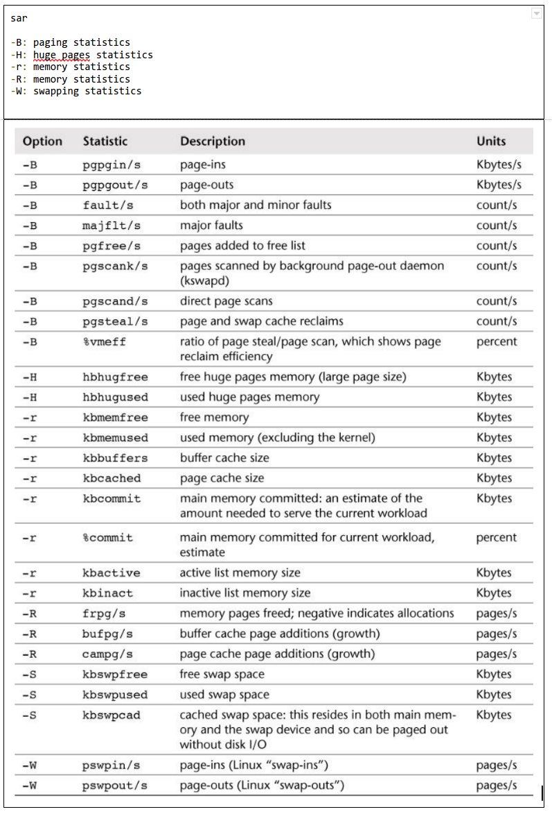

```
slabtop (ran with -sc flags)

 Active / Total Objects (% used)    : 6753116 / 6774957 (99.7%)
 Active / Total Slabs (% used)      : 185021 / 185021 (100.0%)
 Active / Total Caches (% used)     : 80 / 113 (70.8%)
 Active / Total Size (% used)       : 1014591.66K / 1020285.58K (99.4%)
 Minimum / Average / Maximum Object : 0.01K / 0.15K / 15.44K

  OBJS ACTIVE  USE OBJ SIZE  SLABS OBJ/SLAB CACHE SIZE NAME                   
5346549 5341452  99%    0.10K 137091       39    548364K buffer_head
171461 171461 100%    1.01K   5531       31    176992K ext4_inode_cache
479220 478849  99%    0.19K  22820       21     91280K dentry
113360 111131  98%    0.61K   4360       26     69760K proc_inode_cache
120904 119866  99%    0.57K   4318       28     69088K radix_tree_node
 18928  18928 100%    0.55K    676       28     10816K inode_cache

Statistics at top.
OBJS: object count within slab cache
ACTIVE: active objects in slab cache
OBJ SIZE: the size of an individual object
CACHE SIZE: total size of the cache
```

```
ps (ran with aux flags)

USER       PID %CPU %MEM    VSZ   RSS TTY      STAT START   TIME COMMAND
root         1  0.0  0.0 185448  6040 ?        Ss   Oct09   0:10 /sbin/init noprompt persistent text
root         2  0.0  0.0      0     0 ?        S    Oct09   0:00 [kthreadd]
root         3  0.0  0.0      0     0 ?        S    Oct09   0:01 [ksoftirqd/0]
root         5  0.0  0.0      0     0 ?        S<   Oct09   0:00 [kworker/0:0H]
root         7  0.0  0.0      0     0 ?        S    Oct09   3:02 [rcu_sched]
root         8  0.0  0.0      0     0 ?        S    Oct09   0:00 [rcu_bh]

%MEM: main memory usage (phsyical memory, RSS) as a percentage of the total in the system
RSS: resident set size (Kbytes)
VSZ: virtual memory size (Kbytes)

```

```
pmap (ran with flag targeting a pid and -X)
Lists the memory mappings of a process, showing their sizes, permissions, and mapped objects

         Address Perm   Offset Device    Inode   Size   Rss   Pss Referenced Anonymous Swap Locked Mapping
        00400000 r-xp 00000000  08:22 12219668    304   304   304        304         0    0      0 remmina
        0064c000 r--p 0004c000  08:22 12219668      4     4     4          4         4    0      0 remmina
        0064d000 rw-p 0004d000  08:22 12219668     12    12    12         12        12    0      0 remmina
        023ae000 rw-p 00000000  00:00        0   8748  8484  8484       8484      8484    0      0 [heap]
    7f5724000000 rw-p 00000000  00:00        0    136    16    16         16        16    0      0
    7f5724022000 ---p 00000000  00:00        0  65400     0     0          0         0    0      0
    7f572b000000 rw-s 00000000  00:05  7897100  16384  3384  1692       3384         0    0      0 SYSV00000000 (deleted)
    7f572c000000 rw-p 00000000  00:00        0    136    12    12         12        12    0      0
    7f572c022000 ---p 00000000  00:00        0  65400     0     0          0         0    0      0
    7f5730000000 rw-p 00000000  00:00        0    136    12    12         12        12    0      0
    7f5730022000 ---p 00000000  00:00        0  65400     0     0          0         0    0      0
    7f5734000000 rw-p 00000000  00:00        0    696   140   140        140       140    0      0
    7f57340ae000 ---p 00000000  00:00        0  64840     0     0          0         0    0      0
    7f5738f28000 r-xp 00000000  08:22  6049956     20    20     5         20         0    0      0 libnss_dns-2.21.so
    7f5738f2d000 ---p 00005000  08:22  6049956   2044     0     0          0         0    0      0 libnss_dns-2.21.so
    7f573912c000 r--p 00004000  08:22  6049956      4     4     4          4         4    0      0 libnss_dns-2.21.so
    7f573912d000 rw-p 00005000  08:22  6049956      4     4     4          4         4    0      0 libnss_dns-2.21.so
    7f5739130000 r-xp 00000000  08:22  6045442      8     8     0          8         0    0      0 libnss_mdns4_minimal.so.2
    7f5739132000 ---p 00002000  08:22  6045442   2044     0     0          0         0    0      0 libnss_mdns4_minimal.so.2
    7f5739331000 r--p 00001000  08:22  6045442      4     4     4          4         4    0      0 libnss_mdns4_minimal.so.2
    7f5739332000 rw-p 00002000  08:22  6045442      4     4     4          4         4    0      0 libnss_mdns4_minimal.so.2
    7f5739338000 r-xp 00000000  08:22  6041455     40    40     3         40         0    0      0 libnss_files-2.21.so
    7f5739342000 ---p 0000a000  08:22  6041455   2048     0     0          0         0    0      0 libnss_files-2.21.so
    7f5739542000 r--p 0000a000  08:22  6041455      4     4     4          4         4    0      0 libnss_files-2.21.so
    7f5739543000 rw-p 0000b000  08:22  6041455      4     4     4          4         4    0      0 libnss_files-2.21.so
```

## Tuning

### Kernel Params

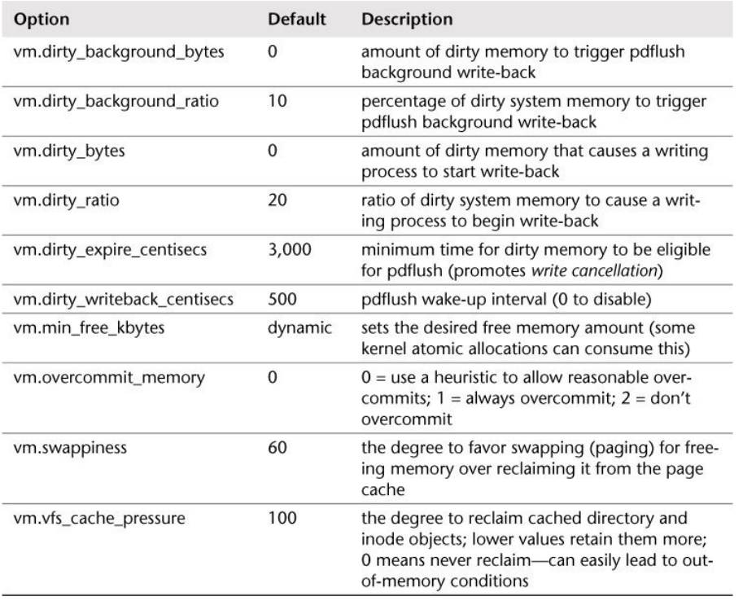

### Multiple Page Sizes

Large page sizes can improve memory I/O performance by improving the hit ratio of the TLB cache (increasing its reach). Enable **Huge Pages** and look into** Transparent Huge Pages (THP)**

### Resource Controls

Basic resource controls, including setting a main memory limit and a virtual memory limit using *ulimit*. Linux has Cgroups also:

* memory.memsw.limit_in_bytes: the maximum allowed memory and swap space, in bytes

* memory.limit_in_bytes: the maximum allowed user memory, including file cache usage,in

* bytes memory.swappiness: similar to vm.swappiness described earlier but can be set for a cgroup

* memory.oom_control: can be set to 0, to allow the OOM killer for this cgroup, or 1, to disable it

# File System Level

## Terminology

<table>
  <tr>
    <td>file system</td>
    <td>an organization of data as files and directories, with a file-based interface for accessing them, and file permissions to control access. additional content may include special file types for devices, sockets, and pipes and metadata including file access timestamps</td>
  </tr>
  <tr>
    <td>file system cache</td>
    <td>an area of main memory (usually dram) used to cache file system contents, which may include different caches for various data and metadata</td>
  </tr>
  <tr>
    <td>operations</td>
    <td>the requests of the file system, including read(), write(). open(), close(), stat(). mkdir() and other operations</td>
  </tr>
  <tr>
    <td>i/o</td>
    <td>input/output. file system i/o can be defined in several ways; her it is used to mean only operations that directly read and write (performing i/o) including read(), write(), stat()(read statistics), and mkdir() (write a new directory). i/o does not include open() and close()</td>
  </tr>
  <tr>
    <td>logical i/o</td>
    <td>i/o issues by the application to the file system</td>
  </tr>
  <tr>
    <td>physical i/o</td>
    <td>i/o issued directly to the disks by the file system (or via raw i/o)</td>
  </tr>
  <tr>
    <td>throughput</td>
    <td>the current data transfer rate between applications and the file system, measured in bytes per second</td>
  </tr>
  <tr>
    <td>inode</td>
    <td>data structure containing metadata for a file system object, including permissions, timestamps, and data pointers</td>
  </tr>
  <tr>
    <td>vfs</td>
    <td>virtual file system, a kernel interface to abstract and support different file system types. </td>
  </tr>
  <tr>
    <td>volume manager</td>
    <td>software for managing physical storage devices in a flexible way, creating virtual volumes from them for use by the os.</td>
  </tr>
</table>


## file system interfaces

a basic model of a file system in terms of interfaces

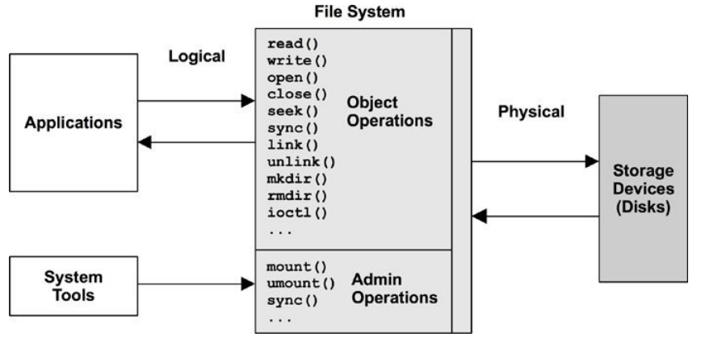

## file system cache

a generic file system cache stored in main memory, servicing a read operation

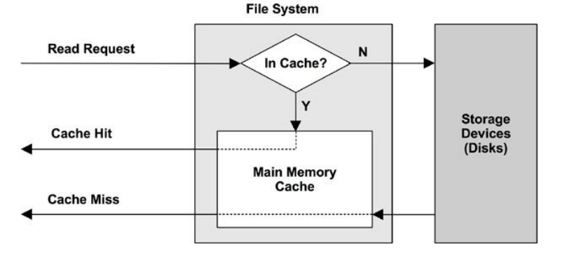

## concepts

### file system latency

the primary metric of file system performance. the time from a logical file system request to it’s completion. inclusive of time spent in the file system, kernel disk i/o subsystem, and waiting on disk devices (physical i/o). processes often block during i/o requests, making i/o directly proportional to application performance (unless non-blocking i/o techniques are used or when i/o is initiated from an asynchronous thread). monitoring i/o latency has been historically difficult and focuses on disks performance. threads doing backround flushes of i/o to disk will look like high bursts of disk i/o latency, however no application is blocked by this. tracing and profiling are necessary to identify these occurences.

### caching

the file system will use main memory (ram) as a cache to improve performance. applications logical i/o latency improves (no latency occurs from disk access). cache memory grows while free memory shrinks as the system remains operation, this is normal and page cache memory can be thought of as "free" however removing pages from the page cache can affect i/o operation latency.

multiple types of cache are used by the file system and block device subsystem.

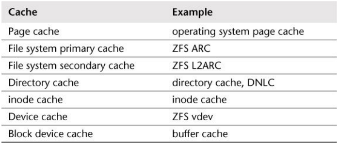

### random vs sequential i/o

a series of logical file system i/o can be described as *random * or *sequential*, based on the file offset of each i/o. sequential i/o means the next i/o begins at the end of the previous i/o. random i/o have no apparent relationship between them, and the offset changes randomly.

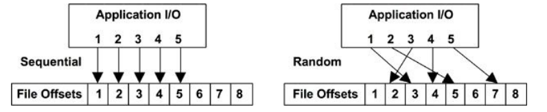

due to performance characteristics of spinning disks, file systems have historically attempted to reduce random i/o by placing file data on disk sequentially and contiguously. this reduces *fragmentation*.

### prefetch (aka read-ahead)

some i/o workloads are too large for memory or will most likely be read into cache once and not accessed again (removing it from cache quickly if it's an lru cache). prefetch combats this by predicting sequential read workloads based on current and previous file i/o offsets. prefetch caches additional blocks that is *assumes* the application will be requesting, if the application does request these blocks they will be in cache when it attempts the request. here’s an example

1. an application issues a file read(), passing execution to the kernel

2. the file system issues the read from disk

3. the previous file offset pointer is compared to the current location, and if they are sequential, the file system issues additional reads

4. the first read completes, and the kernel passes the data and execution back to the application

5. any additional reads complete, populating the cache for future application reads.

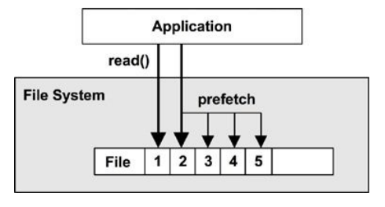

 *application reads to offset 1 and then 2 tigger prefetch for the next 3 offsets*

prefetch is a tunable feature

## write-back caching

treats writes as completed after the transfer to main memory, and writing them to disk happens sometime later, asynchronously. the file system process for writing this "dirty" data to disk is called *flushing.* an example:

1. an application issues a file write(), passing execution to the kernel.

2. data from the application address space is copied into the kernel

3. the kernel treats the write() syscall as completed, passing execution back to the application

4. sometime later, an asynchronous kernel task finds the written data and issues disk writes.

the trade-off is reliability. when writes go to memory, if system failure occurs they can be lost. the flush could also happen incompletely leaving behind an on-disk state that is corrupted.

### synchronous writes

kernel does not return execution to application until write has made it all the way to disk. two forms:

* individual synchronous writes - write i/o is synchronous when a file is opened using the flag o_sync or one of the variants o_dsync and o_rsync. some filesystems have mount options to force all write i/o to all files to be synchronous.

* synchronously committing previous writes - using fsycn() sys call the application flushes writes to disk synchronously as "check-points" (not a technical term) in their code. this can improve performance by grouping synchronous writes at once.

### raw and direct i/o

### raw i/o
issued directly to disk offsets, bypassing the file system all together.

### direct i/o
uses the filesystem but does not utilize the page cache. mapping of file offsets to disk offsets are still performed by filesystem code and i/o may also be resized to match the size used by the file system for on-disk layout (record size). a good time to use direct i/o is for large write operations you don’t want to populate your page cache with.

### non-blocking i/o

can avoid the performance or resource overhead of thread creation. using the o_nonblock or o_ndley flags to open() syscall opens a file descriptor that will issue non-blocking i/o reads and writes. when reading and writing the appropriate functions will return ‘eagain’ error instead of blocking, allowing your application to try later.

## memory-mapped files

mapping files to the process address space and accessing memory offsets directly. avoids syscall execution and context switch overheads when calling read() and write(). can also avoid double copying of data, if the kernel supports direct copying of the file data buffer to the process address space.

created with mmap() syscall and removed using munmap(). mappings can be tuned using madvice().

disadvantage of using mapping on multiprocessor systems can be the overhead to keep each cpu mmu in sync, specifically the cpu cross calls to remove mappings (tlb shootdowns). can be minimized by delaying tlb updates (lazy shootdowns)

### metadata

while data describes the contents of files and directories, metadata describes information about them. may refer to information that can be read from the file system interface (posix) or information needed to implement the file system on-disk layout.

### logical metadata
information that is read and written to the filesystem by consumers (applications), either

  * explicitly: reading file statistics (stat()), creating and deleting files (creat(), unlink()) and directories (mkdir(), rmdir())

  * implicitly: file system access timestamp updates, directory modification timestamp updates

### physical metadata

the on-disk layout metadata necessary to record all file system information. depends on file system type and can include superblocks, inodes, blocks of data pointers (primary, secondary, …) and free lists.

a workload can be "metadata-heavy" typically refers to logical metadata, for example, web servers that stat() files to ensure they haven’t changed since caching, at a much greater rate than actually reading file data contents.

### logical versus physical i/o

i/o requested by applications to the file system (logical i/o) may not match disk i/o (physical i/o) for several resources file systems cache reads, buffer writes, and create additional i/o to maintain the on-disk physical layout metadata needed to record where everything is. this causes unrelated disk i/o (both inflated and deflated) in relation to the original application i/o call. these can be characterized as follows:

### unrelated

  * other applications: the disk i/o is from another application

  * other tenants: the disk i/o is from another tenant (virtualization)

  * other kernel tasks: kernel rebuilding a software raid coume or performing async file system checksum verification (for example)

### indirect:

  * file system prefetch: adding additional i/o that may not be used by the application

  * file system buffering: write-back caching defers and coalesce write for later flushing to disk. may appear as large, infrequent bursts

### deflated
where disk i/o is smaller than application i/o or even nonexistent:

* file system caching: satisfying reads from main memory instead of disk

* file system write cancellation: the same byte offsets are modified multiple times before flushed once to disk.

* compression: reducing the data volume from logical to physical i/o

* coalescing: merging sequential i/o before issuing them to disk.

* in-memory file system: content may never be written to disk (tmpfs)

### inflated
where disk i/o is larger than application i/o:

  * file system metadata: adding additional i/o

  * file system record size: rounding up i/o size (inflating bytes), or fragmenting i/o (inflating count)

  * volume manager parity: read-modify-write cycles, adding additional i/o

### example of 1-byte application write

1. an application performs a 1-byte write to an existing file.

2. the file system identifies the location as part of a 128 kbyte file system record, which is not cached (but the metadata to reference it is)

3. the file system requests that the record be loaded from disk

4. the disk device layer breaks the 128 kbyte read into smaller reads suitable for the device

5. the disks perform multiple smaller reads, totalling 128 kbytes.

6. the file system now replaces the 1 byte in the record with the new byte.

7. sometime later, the file system requests that the 128 kbyte dirty record be written back to disk

8. the disks write the 128 kbyte record (broken up if needed)

9. the file system writes new metadata, for example, references (for copy-on-write) or access time.

10. the disk performs more writes

so while the application performed only a single 1-byte write, the disk performed multiple reads (128 kbytes in total) and more writes (over 128 kbytes).

## file system operation performance

file system operations can exhibit different performance based on their type.

## capacity

when the file system fills, performance may degrade. writing new data may take more time to locate the free blocks on the disk for computation, and any disk i/o needed. areas of free space on disk are likely to be smaller and more sparsely located, degrading performance due to smaller i/o and random i/o.

## architecture:

generic depiction of file system i/o stack

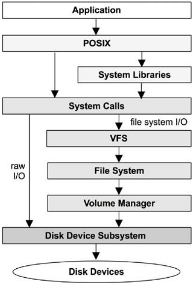

## vfs:

the virtual file system provide a common interface for different file system types.

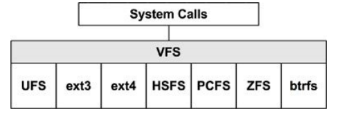

linux re uses the terms *inodes* and *superblock* in the vfs domain (which is also present when talking about data’s (and metadata’s) on-disk structures making things slightly confusing. in documentation you’ll see the on disk structures prefixed with the file system name i.e. *ext4_inode* and *ext4_super_block.*

## file system caches

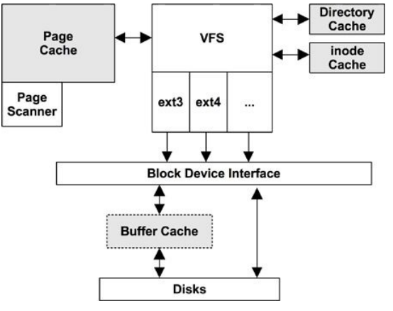

*overview of file system caches in linux*

unix originally had only the buffer cache to improve the performance of block device access. today linux have multiple different cache types.

### page cache
caches virtual memory pages including mapped file system pages. the size is dynamic and will grow to use available memory, freeing it again when applications need it.

  * *flush* flusher threads which are created per device to better balance the per-device workload and improve throughput. pages are flushed to disk for the following reasons:

      * after an interval (30 s)

      * the sync(), fsync(), or msync() system calls

      * too many dirty pages (dirty_ratio)

      * no available pages in the page cache

### dentry cache
remembers mappings from directory entry (struct dentry) to vfs inode. improves path name lookup performance (open()). when path name is traversed, each name lookup can check the dcache for a direct inode mapping, instead of stepping through the directory contents. size can be seen via /proc. will shrink via lru when system needs more memory.

  * negative caching: remembering which lookups lead to non-existent entries. this improves performance of failed lookups, which commonly occur for library path lookup.

### inode cache
contains vfs inodes (struct inode), each describing properties of a file system object, many of which are returned via the stat() system call. inode cache grows dynamically holding at least all inodes mapped by the dcache. will shrink with application memory pressure. size can be seen via /proc

## file system features

### block versus extent

#### block-based file systems
store data in fixed-size blocks, referenced by pointers stored in metadata blocks. for large files this can require many block pointers and metadata blocks, and the placement of blocks may become scattered, leading to random i/o. some block-based file-systems attempt to place blocks contiguously to avoid this. another approach is to use variable block sizes, so that larger sizes can be used as the file grows, which also reduces metadata overhead.

#### extent-based filesystems
preallocate contiguous space for files (extents). growing them as needed. for the cost of space overhead, this improves streaming performance and can improve random i/o performance as file data is localized.

### journaling:

a *log* recording changes to the file system so that in the event of a system crash, changes can be replayed atomically. allows file systems to recovery to a consistent state quickly. the journal is written to disk synchronously, and for some file systems it can be configured to use a separate device. some journals record both data and metadata (i/o written twice, can consume i/o resources) others write only metadata and maintain data integrity by employing copy-on-write.

*log-structured file system* consists of only a journal where all data and metadata updates are written to a continuous and circular log. optimizes write performance, as write are always sequential and can be merged to use larger i/o sizes.

### copy-on-write:

a filesystem that does not overwrite existing blocks but instead follows these steps:

1. write blocks to a new location (a new copy)

2. updates reference to new blocks

3. add old blocks to the free list

this helps file system integrity in the event of a system failure and also improves performance by turning random writes into sequential ones.

### scrubbing

asynchronous reads of all data blocks and verifies checksums, to detect failed drivers as early as possible, ideally while the failure is still recoverable due to raid. scrubbing negatively affects performance.

### todo: filesystem types

## volumes and pools

allow file systems to be built upon multiple disks and can be configured using different raid strategies.

### volumes
present multiple disks as one virtual disk or disk partition (lvm). when built upon whole disks (and not slices or partitions), volumes isolate workloads, reducing performance issues of contention

### pooled storage
multiple disks in a storage pool, from which multiple file systems can be created. pooled storage is more flexible than volume storage, as file systems can grow and shrink regardless of backing devices. this approach is used by *zfs* and *btrfs*. pooled storage can use all disk devices for all file systems, improving performance. workloads are not isolated; in some cases, multiple pools may be used to separate workloads, given the trade-off of some flexibility, as disk devices must be initially placed in one pool or another.

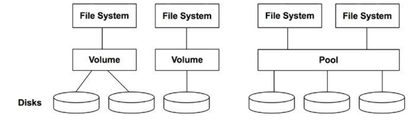

*illustration of volume vs pooled storage*

### additional performance considerations:

* stripe width: matching this to the workload

* observability: virtual device utilization can be confusing, check the separate physical devices.

* cpu overhead: especially when performing raid parity computation. this has become less of an issue on modern, faster cpus

* rebuilding: also called resilvering, this is when an empty disk is added to a raid group (e.g. replacing a failed disk). can significantly hurt performance.

## methodology

### latency analysis
measuring the latency of all file system operations.(not just i/o).

#### operation latency
```
(operation latency)  = time (operation completion) - time (operation request)
```

#### transaction cost
total time spent waiting for the file system during an application transaction.
```
(percent time in file system) = 100 * (total blocking file system latency) / (application transaction time)
```

#### workload characterization
* random versus sequential file offset access

#### advanced workload characterization/checklist

* what is the file system cache hit ratio? miss rate?

* what are the file system cache capacity and current usage?

* what other caches are present (directory, inode, buffer) and what are their stats?

* which applications or users are using the file system?

* what files and directories are being accessed? created and deleted?

* have any errors been encountered? was this due to invalid requests, or issues fom the file system?

* why is the file system i/o issued (user-level call path)?

* to what degree is the file system i/o application synchronous?

* what is the distribution of i/o arrival times?

#### performance characteristics

* what is the average file system operation latency?

* are there any high-latency outliers?

* what is the full distribution of operation latency?

* are system resource controls or the file system or disk i/o present and active?

#### performance monitoring
can identify active issues and patterns of behavior over time. key metrics are operation rate and operation latency. both rate and latency may be recorded for each operation type (read, write, stat, open, close, etc..)

## tools rundown for file systems

### strace
system call debuggers

```
strace timing reads on an ext4 file system

strace -ttt -p 845
[...]
18:41:01.513110 read(9, "\334\260/\224\356k..."..., 65536) = 65536 <0.018225>
18:41:01.531646 read(9, "\371x\265|\244\317..."..., 65536) = 65536 <0.000056>
18:41:01.531984 read(9, "\357\311\347\1\241..."..., 65536) = 65536 <0.005760>
18:41:01.538151 read(9, "*\263\264\204|\370..."..., 65536) = 65536 <0.000033>
18:41:01.538549 read(9, "\205q\327\304f\370..."..., 65536) = 65536 <0.002033>
18:41:01.540923 read(9, "\6\2738>zw\321\353..."..., 65536) = 65536 <0.000032>

-tt prints relative timestamps (on left)
-t  prints the syscall times (on right)

each read() was 64kb, the first taking 18 ms, followed by 56 μs (likely cached), then 5 ms. the reads were to file descriptor 9.
```

### dtrace
dynamic tracing of file system operations, latency

### free
cache capacity statistics
```
free -m
              total        used        free      shared  buff/cache   available
mem:           7863        3786        1892        1164        2184        2583
swap:          8070         178        7892

```

### top
includes memory usage summary
```
mem: 889484k total, 819056k used, 70428k free, 134024k buffers
```

### vmstat
virtual memory statistics
```
vmstat 1
procs -----------memory---------- ---swap-- -----io---- -system-- ------cpu-----
 r  b   swpd   free   buff  cache   si   so    bi    bo   in   cs us sy id wa st
 0  0 182624 1934532  50588 2200652    0    2    20    97  302  228 10  2 87  1  0
 0  0 182624 1927492  50588 2207972    0    0     0     0  198  613  1  0 99  0  0
 0  0 182624 1926648  50588 2207972    0    0     0     0  141  655  1  0 98  0  0
 0  0 182624 1926808  50588 2207840    0    0     0     0  166  569  1  0 99  0  0
 0  0 182624 1926976  50588 2207916    0    0     0     0  250 1646  5  1 94  0  0

buff - buffer cache size (kb)
cache - page cache size (kb)

```

### sar
various statistics, including historically
```
sar -v 1

dentunusd - directory entry cache unused count (available entries)
file-nr - number of file handles in use
inode-nr - number of inodes in use

if ran with -r

kbbuffers - buffer cache size
kbcached - page cache size
```

### slabtop
kernel slab allocator statistics
```
slabtop ran with -o flag

active / total objects (% used)    : 604280 / 689287 (87.7%)
active / total slabs (% used)      : 21103 / 21103 (100.0%)
active / total caches (% used)     : 75 / 136 (55.1%)
active / total size (% used)       : 158667.53k / 181759.62k (87.3%)
minimum / average / maximum object : 0.01k / 0.26k / 18.50k

 objs active  use obj size  slabs obj/slab cache size name                   
147225 113545  77%    0.10k   3775       39     15100k buffer_head            
115437 115017  99%    0.19k   5497       21     21988k dentry                 
57510  48769  84%    1.05k   1917       30     61344k ext4_inode_cache       
53632  44307  82%    0.06k    838       64      3352k kmalloc-64             
50820  45975  90%    0.20k   2541       20     10164k vm_area_struct         
33908  26462  78%    0.57k   1211       28     19376k radix_tree_node        
31348  31348 100%    0.12k    922       34      3688k kernfs_node_cache      
28390  25916  91%    0.05k    334       85      1336k ftrace_event_field     
24064  19544  81%    0.03k    188      128       752k kmalloc-32             
20553  17099  83%    0.08k    403       51      1612k anon_vma               
17528  16545  94%    0.55k    626       28     10016k inode_cache            
14382  11141  77%    0.04k    141      102       564k ext4_extent_status     
14272  12791  89%    0.25k    446       32      3568k kmalloc-256   

shows sizes of various caches, inode_cache and ext4_inode_cache are present here
```

### /proc/meminfo
kernel memory breakdowns
```
cat /proc/meminfo
memtotal:        8052020 kb
memfree:         1702392 kb
memavailable:    2456420 kb
buffers:           54048 kb
cached:          2053356 kb
swapcached:        10344 kb
```

## other tools

**df** : report file system usage and capacity
**mount** : can show file system mounted options
**inotify**: a linux framework for monitoring file system event-based

## experimentation
tools for actively testing file system performance

### ad hoc
*dd* can test sequential file system performance.

```
write: dd if=/dev/zero of=file1 bs=1024k count=1k
read: dd if=file1 of=/dev/null bs=1024k
```

### micro-benchmarking tools

* bonnie, bonnie++

* flexible io tester (fio)

* filebench

### cache flushing
clearing various caches before benchmarking

```
to free pagecache:
  echo 1 > /proc/sys/vm/drop_caches
to free dentries and inodes:
  echo 2 > /proc/sys/vm/drop_caches
to free pagecache, dentries and inodes:
  echo 3 > /proc/sys/vm/drop_caches
```

## tuning

### ext4

**tune2fs**: can be used to tune filesystem settings
**mount**: can be used to adjust file system configuration

**noatime option**: filesystem option for disabling file access timestamp updates, reducing back-end i/o, improving overall performance.

```
tune2fs -o dir_index /dev/{dev}

uses hashed b-trees to speed up lookups in large directories
```

```
e2fsck -d -f /dev/{dev}

used to reindex directories in a file system.
```

# disks level
under high load disks become a bottleneck. *disks* refers to the primary storage devices of the system (both magnetic rotating disks or ssd)

## terminology

<table>
  <tr>
    <td>Virtual disk</td>
    <td>an emulation of a storage device. It appears to the system as a single physical disk; however, it may be constructed from multiple disks</td>
  </tr>
  <tr>
    <td>Transport</td>
    <td>The physical bus used for communication, including data transfers(I/O) and other disk commands</td>
  </tr>
  <tr>
    <td>Sector</td>
    <td>A block of storage on disk, traditionally 512 bytes in size</td>
  </tr>
  <tr>
    <td>I/O</td>
    <td>Strictly speaking for disks, this is reads and writes only and would not include other disk commands. I/O consists of, at least, the direction (read or write), a disk address (location), and a size (bytes) </td>
  </tr>
  <tr>
    <td>Disk commands</td>
    <td>Apart from reads and writes, disks may be commanded to perform other non-data-transfer commands (e.g, cache flush)</td>
  </tr>
  <tr>
    <td>Throughput</td>
    <td>With disks, throughput commonly refers to the current data transfer rate, measured in bytes per second.</td>
  </tr>
  <tr>
    <td>Bandwidth</td>
    <td>This is the maximmum possible data transfer rate for storage transports or controllers</td>
  </tr>
  <tr>
    <td>I/O Latency</td>
    <td>Time for an I/O operation, used more broadly across the operating system stack and not just at the device level. Be aware that networking uses this term differently, with latency referring to the time to initiate an I/O, followed by data transfer time.</td>
  </tr>
  <tr>
    <td>Latency outliers</td>
    <td>disk I/O with unusually high latency</td
  </tr>
</table>

## Models
Simple modules used for illustration of basic principles of disk I/O performance

### Simple disk

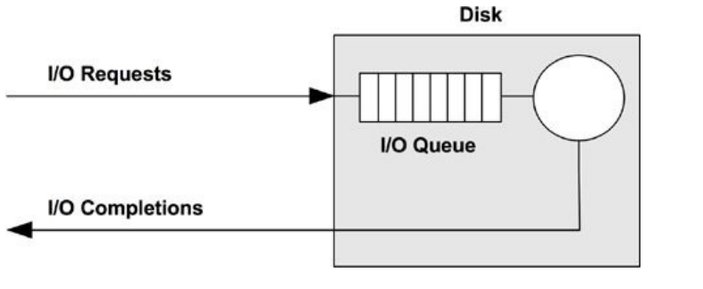

I/O accepted by the disk may be either waiting on the queue or being serviced.

### Caching disk

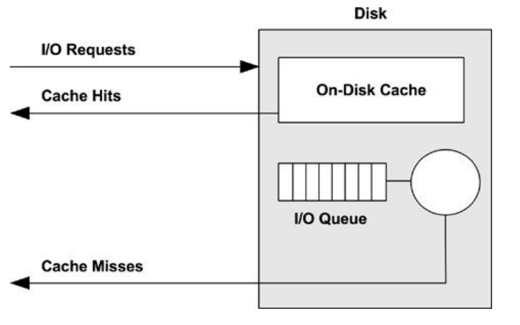

Addition of an on-disk cache allows some read requests to be satisfied from a faster memory type.

Cache can also be used as *write-back* cache. Gives higher level subsystem a write acknowledgment before disk actually writes data to spindles.

### Controller

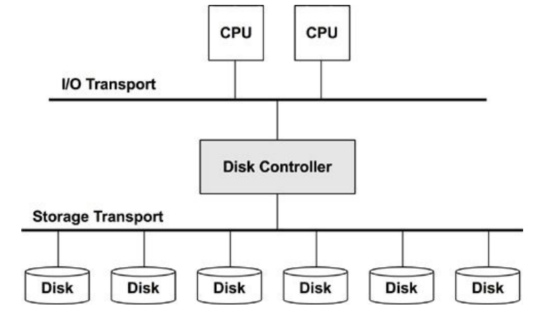

Bridges the CPU I/O transport with the storage transport and attached disk devices. Also called a *host bus adaptor* (HBAs)

## Concepts

### Measuring Time

* **disk I/O Latency**: response time for storage devices; the time from the I/O request to I/O completion.
  * **Service time**: the time an I/O takes to be actively processed (serviced), excluding time waiting on a queue
  * **Wait time**: the time an I/O was waiting on a queue to be serviced

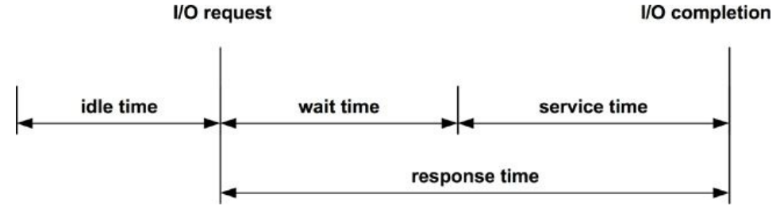

Perspective matters when measuring time. **Disk response time** may describe the service time as observed from the operating system, while **I/O response time** from the perspective of the application may refer to everything beneath the system call layer (service time, all wait times, and code path execution time.)

Service time from the block device is generally treated as a measure of disk performance (iostat); Be aware that other queues and buffers  live before the block device (drivers for the block device) and impose their own latency. This latency is included in service time when analyzing just the block device.

#### Calculating Time

An average disk service time can be inferred using IOPs and utilization

```
(disk service time) = utilization/IOPs
```

For example, a utilization of 60% and an IOPs of 300 gives an average service time of 2 ms (600ms/300 IOPs). This assumes the utilization reflects a single device (or service center), which can process only one I/O at a time. Disks can typically process multiple I/O in parallel.

### Time Scales

The below illustration gives a perspective of time scales.

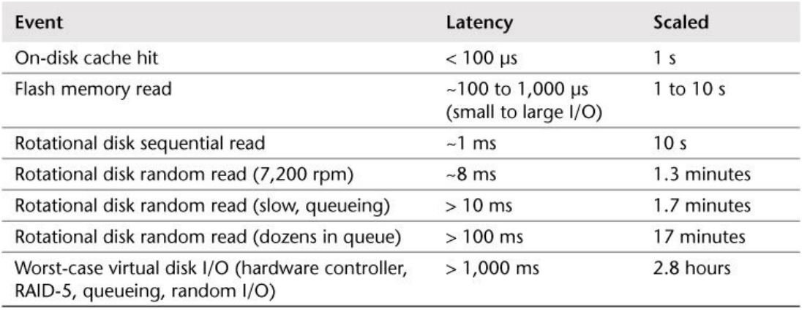

A disk can return two types of latency: one for on-disk cache hits and one for cache misses. These values are typically averaged together, which is not completely accurate. Instead you should consider these two discrete metrics and a histogram does I/O latency visualization better justice.

### Caching

At the disk-device-driver level the following caches are present:

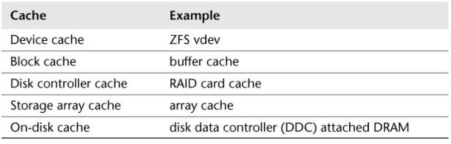

### Random versus Sequential I/O

I/O workload characteristic based on the relative location of the I/O on disk (disk offset). This focuses on magnetic rotating disks. Random I/O created more latency on rotating disks due to seek time (if the reading head was past the target block, the difference of an entire rotation will need to occur before target block is read.)

SSDs should perform no differently between Random and Sequential I/O. (Small differences in SSD architectures may cause some differences)

Random I/O can not be characterized by the OS's perspective of block addresses. The disk controller has it's own maps of address to block lookups which may be different from the OS.

### Read/Write Ratio

I/O workload characteristic measuring the ratio of reads to writes, referring to either IOPs or Throughput. Can be expressed as the ratio over time, as a percentage.

A system with high read rate may benefit most from adding cache. A system with a high write rate may benefit most from adding more disks to increase maximum available throughput and IOPS.

Reads and writes may themselves be different workload patterns (Reads maybe random I/O, while writes may be sequential)

### I/O Size

Average I/O Size, or Distribution of I/O sizes. Larger I/O sizes typically proide higher throughput, although for longer per-I/O latency.

The I/O size may be altered by the disk subsystem (split to 512-byte blocks). I/O can also be Inflated and Deflated (see file systems section)

SSDs perform very different with different read and write sizes. E.g a flash-based disk drive may perform optimally with 4 Kbyte reads and 1 Mbyte writes.

### IOPs

Because of Random/Sequential I/O, Read/Write Ratio, and I/O size, IOPs are not created equal and cannot be directly compared between different devices and workloads. An IOPs value doesn't mean a lot on its own and can't be used alone to accurately compare workloads.

Example:
With rotational disks, a workload of 5,000 sequential IOPs may be much faster then one of 1,000 random IOPs. SSD IOPs are also difficult to compare, since their I/O performance is often relative to I/O size and direction.

IOPs need to viewed in perspective to the 3 factors above. Must use time-based metrics to see IOPs true performance indicators.

#### Non-Data-Transfer Disk Commands

Disks have their own commands for managing disk functions. These are not based on ingress or egress block data. These can affect performance also.

#### Utilization

Time a disk was busy actively performing work during an interval.

Disks at 100% utilization are a likely source of performance issues.

A medial utilization may show the cliff at which disk performance falls off (highly dependent on workload).

To confirm whether high utilization is causing application issues, study the disk reponse time and whether the application is blocking on I/O. Application or operating system may be performing I/O asynchronously, such that slow I/O is not directly causing application to wait.

Monitoring interval matters, a lot of disk I/O happens in bursts which you are possible to miss.

##### Virtual Disk Utilization

Virtual disks built on top of other volumes display the following difficulties when attempting to monitor:

* Virtual disks that include a write-back cache may not appear busy during write workloads, since the disk controller returns write completions immediately, despite the underlying disks being busy sometime afterward.

* A virtual disk that is 100% busy, and is built upon multiple physical disks, may be able to accept more work. In this case, 100% may men that some disks were busy all the time, but not all the disks all the time, and therefore some disks were idle.

You're better off analyzing per disk metrics.

#### Saturation

A measure of queued work beyond what the resource can deliver. For disks: the average length of the device wait queue in the operating system.

A disk at 100% utilization may have no saturation or it may have a lot.

Also: 50% disk utilization during an interval may mean 100% utilized for half that time and idle for the rest.

#### I/O wait

per-CPU performance metric showing time spent idle, when there are threads on the CPU dispatcher queue (in sleep state) that are blocked on disk I/O. This divides CPU idle time into time spent with nothing to do, and time spend block on disk I/O. A high rate of I/O wait per CPU shows that the disks may be bottleneck, leaving the CPU idle while it waits on them.

I/O awit can be misleading. If another process begins to use CPU, I/O wait will go down as the CPU has less idle time, but target process being monitored is still blocking for I/O. On the contrary making a piece of code more efficient may increase the idle time of the CPU, revealing more I/O wait in relation to previous CPU activity.

I/O wait is really measuring: disks busy, CPUs idle. Any wait I/O can be treated as a system bottle neck and removing this is advantageous.

## TODO: Architecture (Physical)

## Operating System Disk I/O Stack

 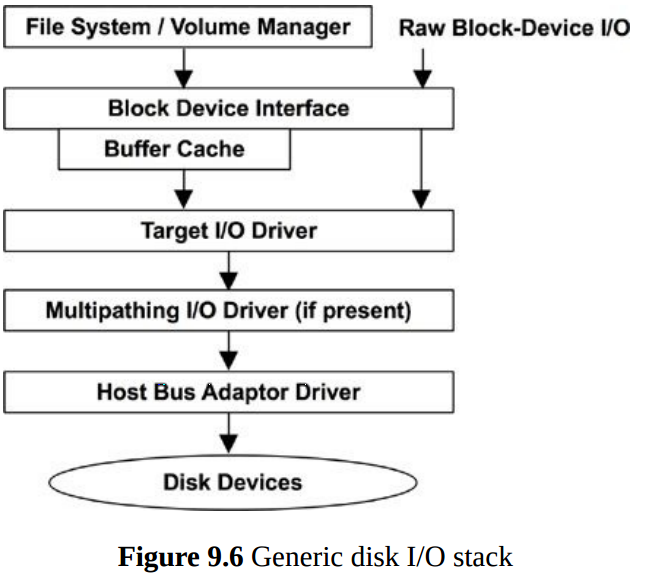

### Block Device Interface

Created to access storage devices in units of blocks, each 512 bytes and to provide buffer cache to improve performance. Buffer cache role has diminished.

Can usually be observed with *iostat*.

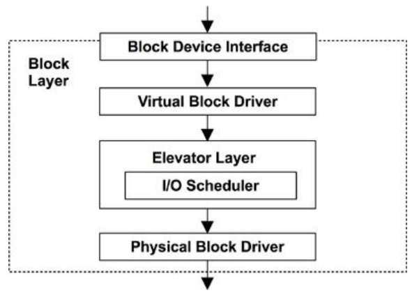

**Elevator layer**: provides generic capabilities to stor, merge, and batch requests for delivery. these capabilities achieve throughput and lower I/O latency.

#### * I/O scheduler policies

  * Noop: This doesn't perform scheduling (noop is CPU-talk for no-operation) and can be used when the overhead of scheduling is deemed unncessary (for example, in a RAMdisk)

	* Deadline: Attempts to enforce a deadline; for example, read and write expiry times in units of milliseconds may be selected. Useful for real-time systems. Can also solve problems of **starvation**: Where I/O request is starved of disk resources as newly issued I/O jump the queue, resulting in latency outliers. Starvation can occur due to *writes starving reads*, and as a consequence of elevator seeking and heavy I/O at one area of disk starving I/O to another. This scheduler uses three separate queues for I/O: read FIFO, write FIFO, and sorted.

	* Anticipatory: an enhanced version of deadline, with heuristics to anticipate I/O performance, improving global throughput. These can include pausing for milliseconds after reads rather then immediately servicing writes, on the prediction that another read request may arrive during that time for a nearby disk location, thus reducing overall rotational disk head seeks.

	* CFQ: The completely fair queueing scheduler allocates I/O time slices to processes, similar to CPU scheduling, for fair usage of disk resources. It also allows priorities and classes to be set for user proceses, via the *ionice* command.

	After I/O scheduling, the request is placed on the block device queue to be issued by the device.   

## Methodology

### Tools

1. *iostat* - using extended mode to look for busy disks (over 60% utilization), high average service times (over, say, 10ms), and high IOPs (depends)
2. *iotop* - to identify which process is causing disk I/O
3. *dtrace/stap/perf* - including *iosnoop* tool to examine disk I/O latency in detail, looking for latency outliers (over, say, 100 ms)

### USE Methodology

#### Disk devices
**Utilization**: The time the device was busy
**Saturation**: The degree to which I/O is waiting in a queue
**Errors**: device Errors

#### Disk controllers
**Utilization**: current versus maximum throughput, and the same for operation rate
**Saturation**: the degree to which I/O is waiting due to controller Saturation
**Errors**: controller Errors

### Workload characteristics

* I/O rate
* I/O throughput
* I/O Size
* Random versus sequential
* Read/write ratio

Example workload:
The system disks have a light random read workload, averaging 350 IOPs with a throughput of 3 Mbytes/s, running at 96% reads. There are occasional short bursts of sequential writes, which drive the disks to a maximum of 4,800 IOPs and 560 Mbytes/s. The reads are around 8 Kbytes in size and the writes around 128 Kbytes

### Advanced Workload Checklist

* What is the IOPs rate system-wide? Per disk? Per Controller?
* What is the throughput system-wide? Per disk? Per Controller?
* Which applications or users are using the disks?
* What file systems or files are being accessed?
* Have any errors been encountered? Were they due to invalid requests, or issues on disk?
* How balanced is the I/O over available disks?
* What is the IOPs for each transport bus involved?
* What is the throughput for each transport bus involved?
* What non-data-transfer disk commands are being issued?
* To what degree is disk I/O application-synchronous?
* What is the distribution of I/O arrival times?

### Performance characteristics

* How busy is each disk (utilization)?
* How saturated is each disk with I/O (wait queuing)?
* What is the average I/O service time?
* What is the average I/O wait time?
* Are there I/O outliers with high latency?
* What is the full distribution of I/O latency?
* Are system resource controls, such as I/O throttling, present and active?
* What is the latency of non-data-transfer disk commands

### Latency Analysis

The time between an I/O request and th completion interrupt. If this matches the I/O latency at the application level, it's usually safe to assume that the I/O latency originates from the disks, allowing you to focus your investigation on them.

### Event Tracing

Logging the following details in order for further analysis

* Disk Device ID
* I/O type: read or write
* I/O offset: disk location
* I/O size: bytes
* I/O request timestamp: when an I/O was issued to the device
* I/O completion timestamp: whn the I/O event completed
* I/O completion status: errors

### Micro Benchmarking

### Disks
* Maximum disk throughput
* Maximum disk operation rate(IOPs): 512-byte reads, offset 0 only
* Maximum disk random reads(IOPs): 512-byte reads, random offsets
* Read latency profile (average microseconds): sequential reads, repeat for 512 bytes, 1 K, 2 K, 4K and so on.
* Random I/O latency profile(average microseconds): 512-byte reads, repeat for full offset span, beginning offsets only, end offsets only.

#### Disk controllers
Disk controllers are tested by applying workloads to multiple disks until the controller is limited.

* Maximum controller throughput(megabytes per second): 128 Kbytes, offset 0 only
* Maximum controller operation rate (IOPs): 512-byte reads, offset 0 only

### TODO: Scaling

## Analysis

### iostat
Various per-disk statistics. *iostat* focuses only on disks. Application I/O may not be displayed in *iostat* if it never makes it to disk.

```
iostat arguments:
-c display CPU report
-d display disk report
-k use kilobytes instead of (512-byte) blocks
-m use megabytes instead of (512-byte) blocks
-p include per-partition statistics
-t timestamp output
-x extended statistics
-z skip displaying zero-activity summaries

without any argumetns -c and -d are specified, first output is summary-since-boot.

$ iostat
avg-cpu:  %user   %nice %system %iowait  %steal   %idle
          11.01    0.15    2.48    1.10    0.00   85.26

Device:            tps    kB_read/s    kB_wrtn/s    kB_read    kB_wrtn
sda               3.45        14.30      1428.42    2386722  238405933

tps - transactions per second (IOPs)
kB_read/s,kB_wrtn/s: kilobytes read per second, and written per second
kB_read,kB_wrtn: total kilobytes read and written

$ iostat -xkdz 1 (extended output)
Device:         rrqm/s   wrqm/s     r/s     w/s    rkB/s    wkB/s avgrq-sz avgqu-sz   await r_await w_await  svctm  %util
sda               0.02     3.45    0.97    2.48    14.28  1426.81   834.61     0.01    3.03    0.68    3.95   1.28   0.44

Device:         rrqm/s   wrqm/s     r/s     w/s    rkB/s    wkB/s avgrq-sz avgqu-sz   await r_await w_await  svctm  %util

Device:         rrqm/s   wrqm/s     r/s     w/s    rkB/s    wkB/s avgrq-sz avgqu-sz   await r_await w_await  svctm  %util
sda               0.00    17.00    0.00   14.00     0.00   120.00    17.14     0.04    2.57    0.00    2.57   2.57   3.60

rrqm/s- read requests placed on the driver request queue and merged per second
wrqm/s- write requests placed on the driver request queue and merged per second
r/s- read requests issues to the disk device per second
w/s- write requests issued to the disk device per second
rkB/s- kilobytes read from the disk device per second
wkB/s- kilobytes written to the disk device per second
avgrq-sz- average request size in sectors (512 bytes)
avgqu-sz- average number of requests both waiting in the driver queue and active on the device
await- average I/O response time, including time waiting in th driver request queue and the I/O response time of the device (ms)
r_await- same as await, but for reads only (ms)
w_await- same as await, but for writes only (ms)
svctm- average (inferred) I/O response time for the disk device (ms)
%util- percent of time the device was busy processing I/O requests (utilization)

Nonezero counts in the rrqm/s and wrqm/s columns show that contiguous requests were merged before delivery to the device, to improve performance.

The r/s and w/s columns show the requests actually issued to the device

Since avgrq-sz is after merging, small sizes (16 sectors or less) are an indicator of a random I/O workload that was unable to be merged. Large sizes may either be larger I/O or a merged sequential workload (indicated by earlier columns)

await is the most important metric for delivered performance. Application may use techniques to mitigate w_await (write-through), focus on r_await instead.

```

### sar
Historical disk statistics

```
sar -d

most columns are same as iostat except:

tps- device data transfers per second
rd_sec/s, wr_sec/s: read and write sectors (512 bytes) per second
```
### pidstat,iotop
disk I/O usage by process

```
pidstat -d 1

04:00:19 PM   UID       PID   kB_rd/s   kB_wr/s kB_ccwr/s iodelay  Command
04:00:20 PM     0     20158     -1.00     -1.00     -1.00       1  kworker/0:0

04:00:20 PM   UID       PID   kB_rd/s   kB_wr/s kB_ccwr/s iodelay  Command
04:00:21 PM     0     20184     -1.00     -1.00     -1.00       1  kworker/1:0

04:00:21 PM   UID       PID   kB_rd/s   kB_wr/s kB_ccwr/s iodelay  Command
04:00:22 PM     0     20158     -1.00     -1.00     -1.00       1  kworker/0:0

04:00:22 PM   UID       PID   kB_rd/s   kB_wr/s kB_ccwr/s iodelay  Command
04:00:23 PM     0       196     -1.00     -1.00     -1.00       4  jbd2/sda2-8
04:00:23 PM  1000      3877      0.00     40.00      4.00       0  chrome
04:00:23 PM  1000     19461      0.00     16.00      4.00       0  atom
04:00:23 PM     0     20158     -1.00     -1.00     -1.00       1  kworker/0:0

kB_red/s- kilobytes read per second
kB_wd/s- kilobytes issued for write per second
kB_ccwr/s- kilobytes cancled for write per second (w.g. overwritten before flush)

```

```
iotop

-b --batch log usage over time (non interactive)
-P only show processes. Normally iotop shows all threads.
-a Show accumulated I/O instead of bandwidth.
-k kilobytes
-t add timestamps on each limit_in_bytes

iotop -b -p {pid}

Total DISK READ :       0.00 B/s | Total DISK WRITE :       0.00 B/s
Actual DISK READ:       0.00 B/s | Actual DISK WRITE:       0.00 B/s
  TID  PRIO  USER     DISK READ  DISK WRITE  SWAPIN      IO    COMMAND
11338 be/4 ldelossa    0.00 B/s    0.00 B/s  0.00 %  0.00 % spotify
Total DISK READ :       0.00 B/s | Total DISK WRITE :       0.00 B/s
Actual DISK READ:       0.00 B/s | Actual DISK WRITE:       0.00 B/s
  TID  PRIO  USER     DISK READ  DISK WRITE  SWAPIN      IO    COMMAND
11338 be/4 ldelossa    0.00 B/s    0.00 B/s  0.00 %  0.00 % spotify
Total DISK READ :       0.00 B/s | Total DISK WRITE :       0.00 B/s
Actual DISK READ:       0.00 B/s | Actual DISK WRITE:       0.00 B/s
  TID  PRIO  USER     DISK READ  DISK WRITE  SWAPIN      IO    COMMAND
11338 be/4 ldelossa    0.00 B/s    0.00 B/s  0.00 %  0.00 % spotify
Total DISK READ :       0.00 B/s | Total DISK WRITE :       0.00 B/s
Actual DISK READ:       0.00 B/s | Actual DISK WRITE:     179.71 K/s
  TID  PRIO  USER     DISK READ  DISK WRITE  SWAPIN      IO    COMMAND
11338 be/4 ldelossa    0.00 B/s    0.00 B/s  0.00 %  0.00 % spotify

```

### blktrace
disk I/O event tracing. We use the command btrace

```
# btrace /dev/sdb
8,16 3 1 0.429604145 20442 A R 184773879 + 8 <- (8,17) 184773816
8,16 3 2 0.429604569 20442 Q R 184773879 + 8 [cksum]
8,16 3 3 0.429606014 20442 G R 184773879 + 8 [cksum]
8,16 3 4 0.429607624 20442 P N [cksum]
8,16 3 5 0.429608804 20442 I R 184773879 + 8 [cksum]
8,16 3 6 0.429610501 20442 U N [cksum] 1
8,16 3 7 0.429611912 20442 D R 184773879 + 8 [cksum]
8,16 1 1 0.440227144 0 C R 184773879 + 8 [0]

Columns:
[device major, device minor] [CPU ID] [Sequence Number] [Action time, in seconds] [Process ID] [Action identifier] [RWBS description]

Action Identifiers (use -a to filter by actions):

A IO was remapped to a different device
B IO bounced
C IO completion
D IO issued to driver
F IO front merged with request on queue
G Get request
I IO inserted onto request queue
M IO back merged with request on queue
P Plug request
Q IO handled by request queue code
S Sleep request
T Unplug due to timeout
U Unplug request
X Split

RWBS Description:
R(read)
W(write)
D(block discard)
B(barrier operation)
S(synchronous)
```

### MegaCLI
LSI controller statistics

### smartctl
disk controller statistics using (SMART)

## Experimentation

### Ad Hoc
The dd command can be used to perform ad hoc tests of sequential disk performance. For example, testing sequential read with a 1 Mbyte I/O size:

```
# dd if=/dev/sda1 of=/dev/null bs=1024k count=1k
1024+0 records in
1024+0 records out
1073741824 bytes (1.1 GB) copied, 7.44024 s, 144 MB/s
```

Sequential write can be tested similarly.

### Custom Load Generators
You can write short C programs that open the device path and applies the intended workload.
You can open these device paths with O_DIRECT to avoid buffering.

### hdparm
*hdparm* can be used as a micro-benchmarking tool.

```
hdparm -Tt /dev/sda

-T test cached reads
-t tests disk device reads

/dev/sda:
Timing cached reads:   20682 MB in  2.00 seconds = 10350.50 MB/sec
Timing buffered disk reads: 292 MB in  3.00 seconds =  97.33 MB/sec
```

## Tuning

### Operating system

#### ionice
Can be used to set an I/O scheduling class and priority for a process. Scheduling classes:

* 0, none: no class specified, so the kernel will pick a default(best effort) with a priority based on the process nice value
* 1, real-time: highest-priority access to the disk. If misused, this can starve other other processes
* 2, best effort: default scheduling class, supporting priorities 0-7, with 0 the highest-priority
* 3, idle: disk I/O allowed only after a grace period of disk idleness

#### Cgroups
Limits block I/O subsystem operations. Can be in shares or fixed limits.

#### Tunable Parameters

**/sys/block/sda/queue/scheduler**: allows you to select I/O scheduler policy.

# Network Level

## Terminology

<table>
  <tr>
    <th>Interface</th>
    <th>the term interface port refers to the physical network connector. The term interface or link refers to the logical instance of a network interface port, as seen and configured by the OS.</th>
  </tr>
  <tr>
    <td>Packet</td>
    <td>The term packet typically refers to an IP-level routable message. </td>
  </tr>
  <tr>
    <td>Frame</td>
    <td>a physical network-level message, for example, an Ethernet frame</td>
  </tr>
  <tr>
    <td>Bandwidth</td>
    <td>the maximum rate of data transfer from the network type, usually measured in bits per second. "10 GbE" is Ethernet with a bandwidth of 10 Gbits/s</td>
  </tr>
  <tr>
    <td>Throughput</td>
    <td>the current data transfer rate between the network endpoint, measured in bits per second or bytes per second</td>
  </tr>
  <tr>
    <td>Latency</td>
    <td>Network latency can refer to the time it takes for a message to make a round trip between endpoints, or the time required to establish a connection (e.g. TCP handshake), excluding the data transfer time that follows. </td>
  </tr>
</table>

## Models

### Network Interface
Network interfaces are mapped to physical network ports as part of their configuration. Ports connect to the network and typically have separate transmit and receive channels.

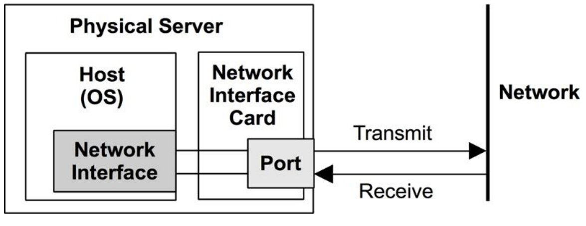

### Controller
A *network interface card* (NIC) provides one or more network ports for the system and houses a *network controller*: a microprocessor for transferring packets between the ports and the system I/O transport.

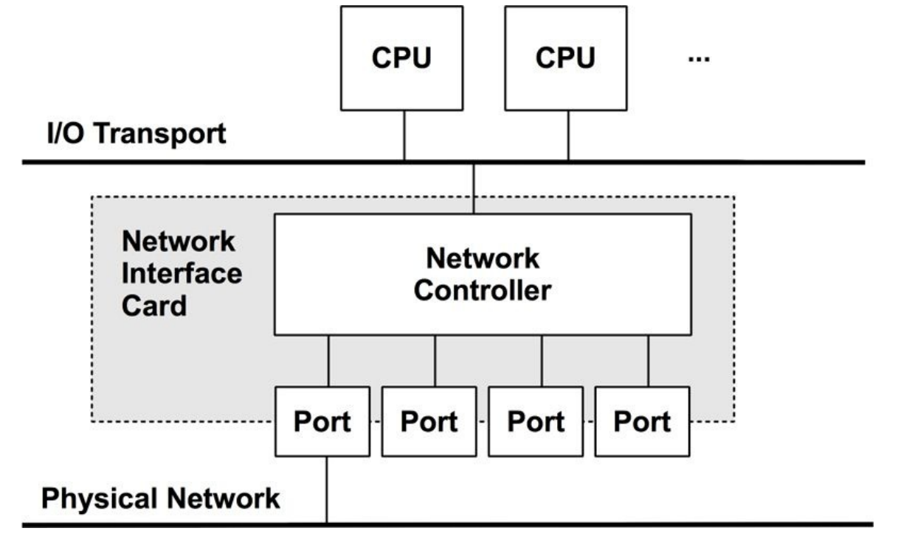

### Protocol Stack
Networking is accomplished by a stack of protocols, each layer of which servers a particular purpose.

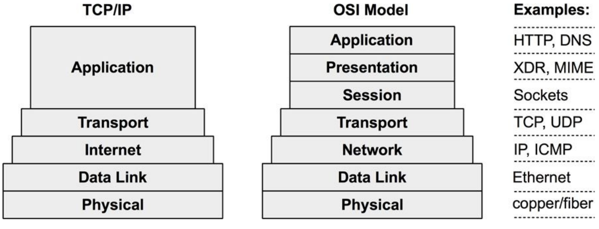

Sent messages move down the stack from the application to the physical network. Received messages move up. Wider levels indicate protocol encapsulation.

## Concepts

### Latency
Can be measured in different ways: *name resolution latency, ping latency, connection latency, first-byte latency, round-trip time, and connection life span.*

#### Name resolution latency
Host name to IP resolution via DNS. Time this takes is *Name resolution latency*

#### Ping Latency
Uses ICMP echo request and echo response to measure latency. Can be used to measure network latency between hosts, including hops in between. Ping latency expectations

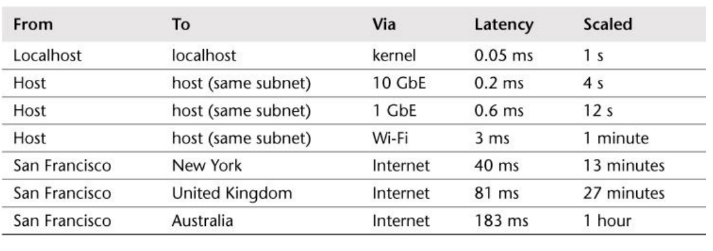

Sending side of icmp has slightly more overhead due to timestampes being measured from user-land, such that kernel context switching and kernel code path time are included.

#### Connection Latency  
Time to establish a network connection, before any data is transfered. For TCP this is the *TCP handshake time*. Time from the client sending a SYN to receiving the corresponding SYN-ACK.

Similar to ping latency, but more kernel code is executed along with taking time to retransmit any dropped packets. If server's SYN backlog is full, the server can drop the SYN. The client then attempts to retransmit the SYN.

Followed by *first-byte latency*

#### First-Byte Latency
AKA *time to first byte*. From client's perspective, the time until the first byte is received from the server. This includes connection establishment to server, processing time of the server, and network latency between both nodes. This is a good indication of server performance from  clients perspective.

#### Connection life span
Connection life span is the time from when a network connection is established to when it is closed.

### Buffering

Allows network throughput to be sustained at high rates despite various network latencies that may occur. Buffers can be used on both sender and receiver sides. Larger buffers can mitigate the effects of higher round-trip times by continuing to send data before blocking and waiting for an acknowledgment.

*buffer bloat* packets are queued for long intervals. Triggers TCP Congestion Avoidance on the hosts, which throttles performance. Mitigation in the linux kernel has been introduced (byte queue limits, CoDel queue management, TCP small queues).

Buffering should be done at the end points, and not the intermediate network nodes. Principle called *end-to-end arguments*

### Connection backlog

Another type of buffering for initial connection requests. TCP implements a backlog, where SYN requests can queue in the kernel before being accepted by the user-land process. Once backlog limit is reached, server will begin to drop new SYN packets.

Measuring backlog drops measure network connection saturation.

### Utilization

Calculated as the current throughput over the maximum bandwidth.

Full duplex, utilization applies to each direction and is measured as the current throughput for that direction over the current negotiated bandwidth.

Once a network interface direction reaches 100% utilization, it becomes a bottleneck, limiting performance

### Local Connections
Network connections between two applications on the same host use the virtual network interface: *loopback*

Connecting via IP to localhost is the IP sockets technique of inter-process communication. Unix sockets are available also, skipping the overhead of TCP for local socket connections.

For TCP/IP sockets, the kernel may detect the localhost connection after the handshake, and then shortcut the TCP/IP stack for data transfers, improving performance.

## Architecture

### protocols

#### TCP
TCP can provide a high rate of throughput even on a high-latency network. This is accomplished via buffering and *sliding window*.  Congestion control exists along with a *congestion window* set by the sender to maintain a high but also appropriate rate of transmission across different and varying networks.

##### Sliding window
This allows multiple packets up to the size of the window to be sent on the network before acknowledgements are received, providing high throughput even on high-latency networks. Size of the window is advertised by receiver to indicate how many packets it is willing to receive at a time.

##### Congestion avoidance
To prevent sending too much data and causing saturation, which can cause packet drops and worse performance

##### Slow-start
Part of TCP congestion control, this begins with a small congestion window and then increases it as acknowledgments (ACKs) are received within a certain time. When they are not, the congestion window is reduced.

##### Selective Acknowledgments (SACKs)
allow TCP to acknowledge discontinuous packets, reducing the number of retransmits required

##### Fast retransmit
Instead of waiting on a timer, TCP can retransmit dropped packets based on the arrival of duplicate ACKs. These are a function of round-trip time and not the typically much slower timer.

##### Fast recovery
This recovers TCP performance after detecting duplicate ACKs, by resetting the connection to perform slow-stary

##### Three way handshake

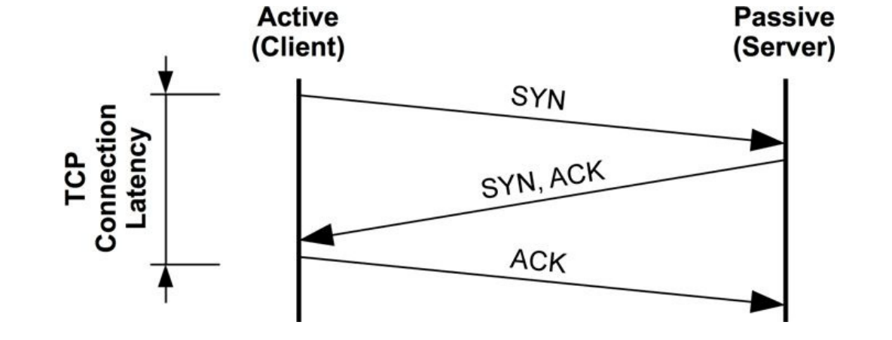

##### Duplicate ACK detection
Used by fast retransmit and fast recovery.

1. The sender sends a packet with sequent number 10.
2. The receiver replies with an ACK for sequence number 11.
3. The sender sends 11, 12, and 13.
4. Packet 11 is dropped
5. The receiver replies to both 12 and 13 by sending an ACK for 11, which it is still expecting.
6. The sender receives the duplicate 11 ACKs.

##### Congestion Control: Reno and Tahoe

**Reno**: Triple duplicate ACKs trigger: halving the congestion window, halving o the slow start threshold, fast retransmit, and fast recovery

**Taho**: Tripe duplicate ACKs trigger: fast retransmit, halving the slow-start threshold, congestion window set to one maximum segment size (MSS), and slow-start State

Other algos: **Vegas**, **New Reno**, and **Hybla**

##### Nagle
Reduces the number of small packets on a network by delaying their transmission to allow more data to arrive and coalesce. This delays packets only if there is data in the pipeline and delays are already being encountered. Can cause issues with delayed ACKs

##### Delayed ACKs
This algorithm delays snding of ACKs up to 500ms, so that multiple ACKs may be combined.

##### SACK and FACK
TCP Selective acknowledgment (SACK) algorithm allows the receiver to inform the sender that it received a noncontiguous block of data. Without this, a packet drop would eventually cause the entire send  window to be retransmitted, to preserve a sequential acknowledgement scheme. This harms TCP peformance and is avoided by most modern operating systems that support SACK.

SACK has been extended by forward acknowledgments (FACK), which are supported in Linux be default. FACKs track additional state and better regulate the amount of outstanding data in the network improving overall performance.

#### UDP

Messages in UDP are called *datagrams*

UDP Provides:

**Simplicity**: Simple and small protocol headers reduce overheads of computation and size
**Statelessness**: lower overheads for connections and retransmission.
**No retransmits**: These add significant latencies for TCP connections.

## Software

Includes **Network Stack**, **TCP**, and **device drivers**.

### Network Stack

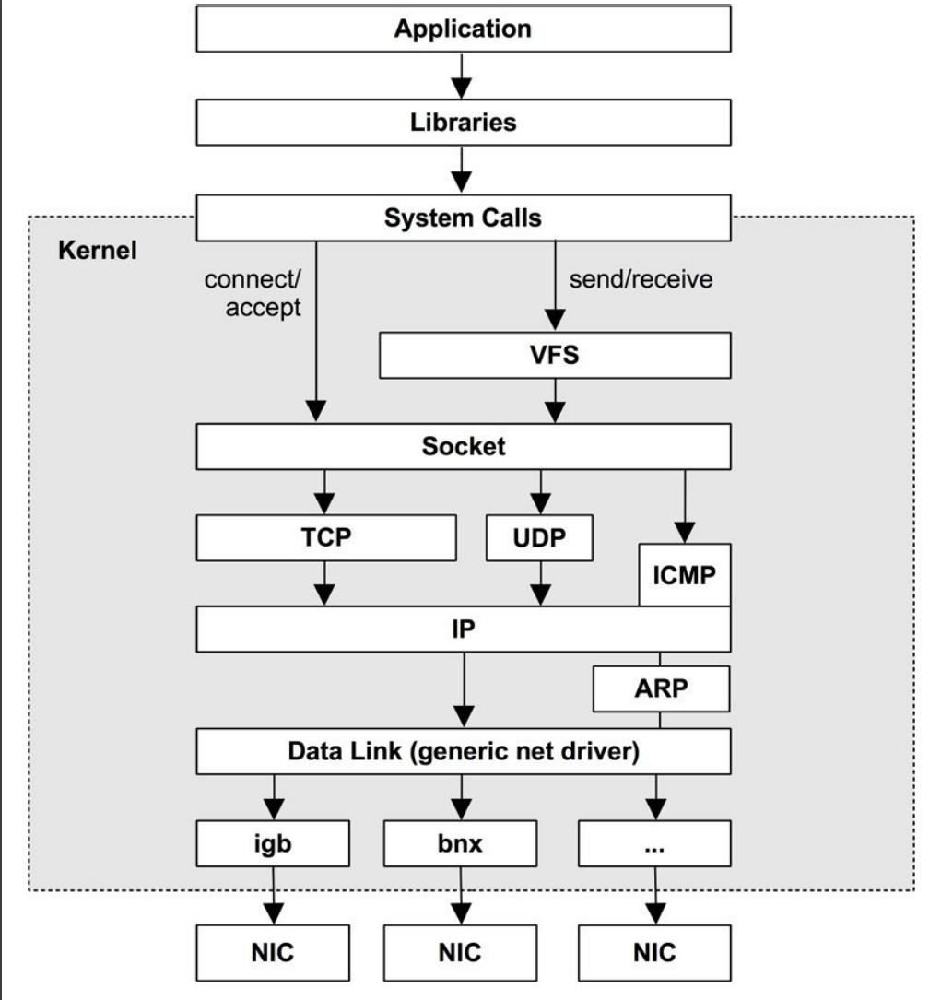

This stack is multithreaded, and inbound packets can be processed by multiple CPUs.

* **Mapping of an inbound packet to a CPU**
  * Based on a hash of th source IP address, to evenly spread out load
	* Based on the CPU where the socket was most recently processed, to benefit from CPU cache warmth and memory locality.

TCP, IP and generic net driver software are core kernel components with device drivers as additional modules. Packets are passed through these kernel components as the struct *sk_buff* data type.

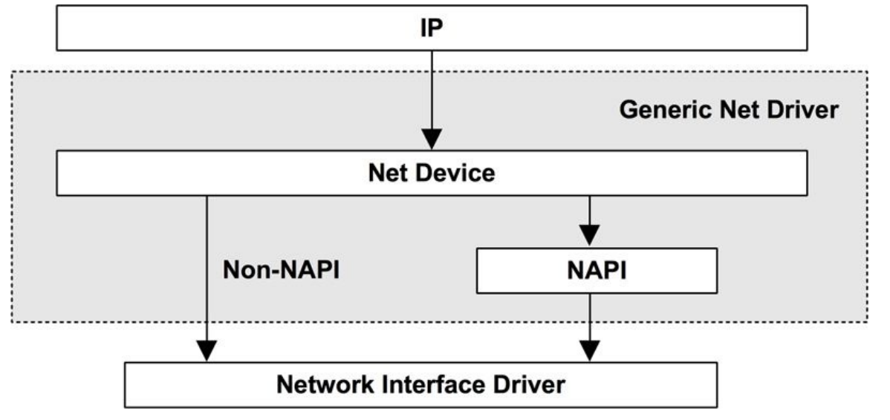

#### Techniques for high packet throughput

* **RSS: Receive Side Scaling**: for modern NICs that support multiple queues and can hash packets to different queues, which are in turn processed by different CPUs by interrupting them directly. This hash may be based on the IP addres and the TCP port numbers, so that packets from th same connection end up being processed by the same CPU.

* **RPS: Receive Packet Steering**: a software implementation of RSS, for NICs that do not support mulitple queues. This involves a short interrupt service routine to map the inbound packet to a CPU for processing. A similar hash can be used to map packets to CPUs, based on fields from the packet headers.

* **RFS: Receive Flow Steering**: This is similar to RPS, but with affinity for where th socket was las processed on-CPU, to improve CPU cache hit rates and memory locality.

* **Accelerated Receive Flow Steering**: This achieves RFS in hardware, for NICs that support this functionality. It involves updating the NIC with flow information so that it can determine which CPU to interrupt.

* **XPS: Transmit Packet Steering**: For NICs with multiple transmit queues, this supports transmission by multiple CPUs to the quues.

#### TCP

Bursts of connections are handled by using backlog queues. Two such queues, one for incomplete connections while the TCP handshake completes (also known as the SYN backlog), and one for established connections waiting to be accepted by the application (also known as the listen backlog)

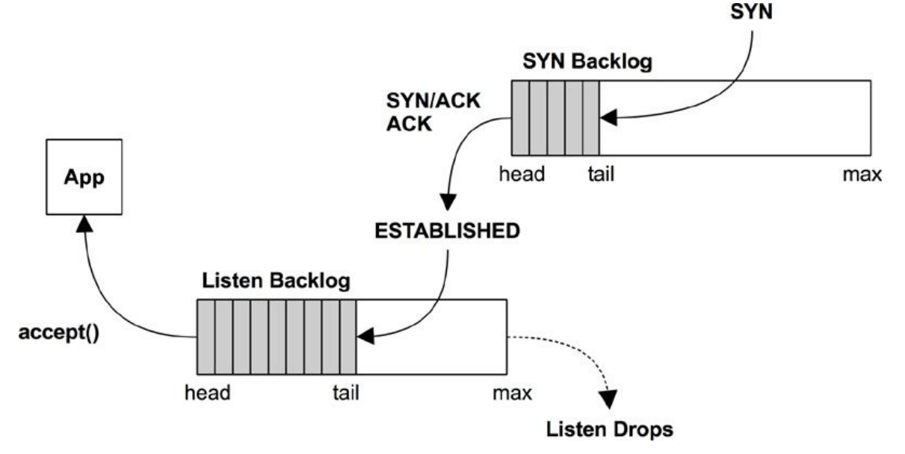

Data throughput is improved by using send and receive buffers associated with the socket.

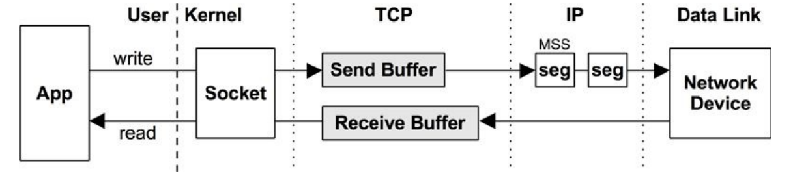

In the write path, the data is bufferd in the TCP send buffer, and then sent to IP for delivery. While the IP protcol has the capability to fragment packets, TCP tries to avoid this by sending data as MSS size segments to IP. This means unit of (re-)transmission matches the unit of fargmentation; otherwise a dropped fragment would require retransmission of the entire prefragmented packet.

TCP SEND and RECEIVE buffers are tunable. Larger buffers can increase throughput.

## Methodology

### Tools Methodology

**netstat -s**: Look for a high rate of retransmits and out-of-order packets. What constitutes a "high" retransmit rate depends on the client: an Internet-facing system with unreliable remote clients should have a higher retransmit rate than an internal system with clients in the same data center.

**netstat -i**: Check interface error counters

**ifconfig**: check "errors", "dropped", "overruns"

**Throughput**: Check the rate of bytes transmitted and received *ip* command on linux. High throughput may hit line rate for negotiated speed and be limited. It could also cause contention and delays between network users on the system.

**tcpdump/snoop**: Dumps packet and operation information. Good way to quickly trace traffic, but CPU intensive

### USE Methodology

 **Utilization**: Time the interface was busy sending or receiving frames. Can be calculated as the current throughput divided by the current negotiated speed. Current throughput should be measured as bytes per second on the network, including all protocol headers.
 **Saturation**: The degree of extra queueing, buffering, or blocking due to a fully utilized interface.
 **Errors**: for receive: bad checksum, frame too short(less than the data link header) or too long, collisions; for transmit: late collisions (bad wiring)

### Workload characterization

**Network interface throughput**: RX and TX, bytes per second
**Network interface IOPs**: RX and TX, frames per second
**TCP connection rate**: active and passive, connections per second

Example workload description:

*The network throughput varies based on users and performs more writes (TX) than reads (RX). The peak write rate is 200 Mbytes/s and 210,000 packets/s, and the peak read is 10 Mbyte/s with 70,000 packets/s. The inbound (passive) TCP connection rate reaches 3,000 connections/s*

### Advanced Workload Characterization

What is the average packet size? RX, TX?
What is the protocol breakdown? TCP versus UDP?
What TCP/UDP ports are active? Bytes per second, connections per second?
Which processes are actively using the network?

### Latency Analysis

* **System call send/receive latency**: time for the socket read/write calls
* **System call connect latency**: for connection establishment; note that some applications perform this as a non-blocking syscall.
* **TCP connection initialization time**: Time for the three-way handshake
* **TCP first-byte latency**: Time between the connection establishment and receiving the fist data bytes
* **TCP connection duration**: time from established to closed
**Network round-trip time**: time for a packet to travel from client to server and back
* **TCP retransmits**: if present, can add thousands of milliseconds of latency to network I/O
* **Interrupt latency**: Time from a network controller interrupt for a received packet to when it is serviced by the kernel.
* **Inter-stack latency**: Time for a packet to move through the kernel TCP/IP stack

### TCP analysis

* Usage of TCP send/receive buffers
* Usage of TCP backlog queues
* Kernel drops due to the backlog queue being full
* Congestion window size, including zero-size advertisements
* SYNs received during a TCP TIME-WAIT interval

#### Ephemeral Port Exhaustion
The last behavior can become a scalability problem when a server is connecting frequently to another on the same destination port, using the same source and destination IP addresses. The only distinguishing factor for each connection is the client source port—the ephemeral port—which for TCP is a 16-bit value and may be further constrained by operating system parameters (minimum and maximum). Combined with the TCP TIME-WAIT interval, which may be 60 s, a high rate of connections (more than 65,536 during 60 s) can encounter a clash for new connections. In this scenario, a SYN is sent while that ephemeral port is still associated with a previous TCP session that is in TIMEWAIT, and the new SYN may be rejected if it is misidentified as part of the old connection (a collision). To avoid this issue, the Linux kernel attempts to reuse or recycle connections quickly (which usually works well).

## Analysis

### netstat
various network stack and interface statistics

```
-a lists information for all sockets
-s network stack statistics
-i network interface statistics
-r lists th route table
-n no name resolution
-v verbose

netstat -i

Kernel Interface table
Iface   MTU Met   RX-OK RX-ERR RX-DRP RX-OVR    TX-OK TX-ERR TX-DRP TX-OVR Flg
enp0s25    1500 0         0      0      0 0             0      0      0      0 BMU
lo        65536 0    212804      0      0 0        212804      0      0      0 LRU
wlp3s0     1500 0   5432116      0      0 0       1343351      0      0      0 BMRU

Columns: [interface] [MTU] [RX-*] [TX-*]

OK: packet transferred successfully
ERR: packet errors
DRP: packet drops
OVR: packet overruns

Drops and overruns are indication of network interface saturation.

```

For -s option look for:
* A high rate of forwarded versues total packets received: check that the server is supposed to be forwarding (routing) packets.
* Passive connection openings: this can be monitored to show load in terms of client connections
* A high rate of segments retransmitted versus segments sent out: can show an unreliable network. This may be expected (internet clients)
* Packets pruned from the receive queue because of socket buffer overrun: This is a sign of network saturation and may be fixable by increasing socket buffers -- providing there are sufficient system resources for the application to keep up.

### sar
historical statistics
```
-n DEV: network interface statistics
-n EDEV: network interface errors
-n IP: IP datagram statistics
-n EIP: IP error statistics
-n TCP: TCP statistics
-n ETCP: TCP error statistics

```
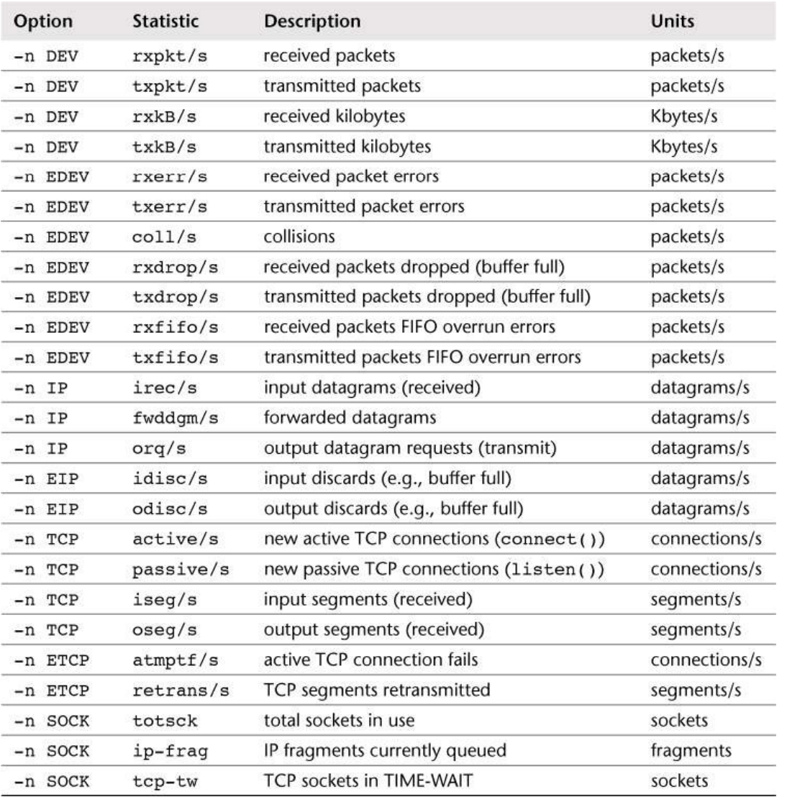

### ifconfig
interface configuration, now replaced by ip

```
txqueuelen: length of the transmit queue for the interfaces.
```

### ip
network interface statistics

```
ip -s link

1: lo: <LOOPBACK,UP,LOWER_UP> mtu 65536 qdisc noqueue state UNKNOWN mode DEFAULT group default qlen 1
    link/loopback 00:00:00:00:00:00 brd 00:00:00:00:00:00
    RX: bytes  packets  errors  dropped overrun mcast   
    17742089   213026   0       0       0       0       
    TX: bytes  packets  errors  dropped carrier collsns
    17742089   213026   0       0       0       0       
2: enp0s25: <NO-CARRIER,BROADCAST,MULTICAST,UP> mtu 1500 qdisc pfifo_fast state DOWN mode DEFAULT group default qlen 1000
    link/ether 54:ee:75:2e:e7:19 brd ff:ff:ff:ff:ff:ff
    RX: bytes  packets  errors  dropped overrun mcast   
    0          0        0       0       0       0       
    TX: bytes  packets  errors  dropped carrier collsns
    0          0        0       0       0       0       
3: wlp3s0: <BROADCAST,MULTICAST,UP,LOWER_UP> mtu 1500 qdisc mq state UP mode DORMANT group default qlen 1000
    link/ether 7c:7a:91:1a:b2:79 brd ff:ff:ff:ff:ff:ff
    RX: bytes  packets  errors  dropped overrun mcast   
    7483166775 5436573  0       0       0       0       
    TX: bytes  packets  errors  dropped carrier collsns
    223562920  1346384  0       0       0       0     
```

### nicstat
network interface throughput and utilization

```
nicstat -z 1
    Time      Int   rKB/s   wKB/s   rPk/s   wPk/s    rAvs    wAvs %Util    Sat
19:33:38   wlp3s0   46.73    1.40   34.76    8.61  1376.4   166.0  0.00   0.00
19:33:38       lo    0.11    0.11    1.36    1.36   83.29   83.29  0.00   0.00
    Time      Int   rKB/s   wKB/s   rPk/s   wPk/s    rAvs    wAvs %Util    Sat
19:33:39   wlp3s0    0.18    0.30    1.00    2.00   181.0   151.5  0.00   0.00
    Time      Int   rKB/s   wKB/s   rPk/s   wPk/s    rAvs    wAvs %Util    Sat
19:33:40   wlp3s0    0.21    0.00    1.00    0.00   215.0    0.00  0.00   0.00
    Time      Int   rKB/s   wKB/s   rPk/s   wPk/s    rAvs    wAvs %Util    Sat
19:33:41   wlp3s0    0.52    0.83    8.00    9.00   66.00   94.00  0.00   0.00

%Util: maximum utilization
Sat: value reflecting interface saturation statistics
Kb/s (r or w): kilobytes per second
Pk/s (r or w): packets per second
Avs/s (r or w): average packet size, bytes
```

### ping
test network connectivity

```
PING www.google.com (172.217.2.4) 56(84) bytes of data.
64 bytes from lga15s45-in-f4.1e100.net (172.217.2.4): icmp_seq=1 ttl=55 time=25.1 ms
64 bytes from lga15s45-in-f4.1e100.net (172.217.2.4): icmp_seq=2 ttl=55 time=37.9 ms
64 bytes from lga15s45-in-f4.1e100.net (172.217.2.4): icmp_seq=3 ttl=55 time=23.8 ms
^C
--- www.google.com ping statistics ---
3 packets transmitted, 3 received, 0% packet loss, time 2001ms
rtt min/avg/max/mdev = 23.885/29.013/37.963/6.353 ms

rrt: rount rip time
```

### traceroute
test network routes

### pathchar
determine network path characteristics

### tcpdump
network packet sniffer

### Wireshark
graphical network packet inspection

### Dtrace, perf
TCP/IP stack tracing: connections, packets, drops, latency

## TODO: Tuning
